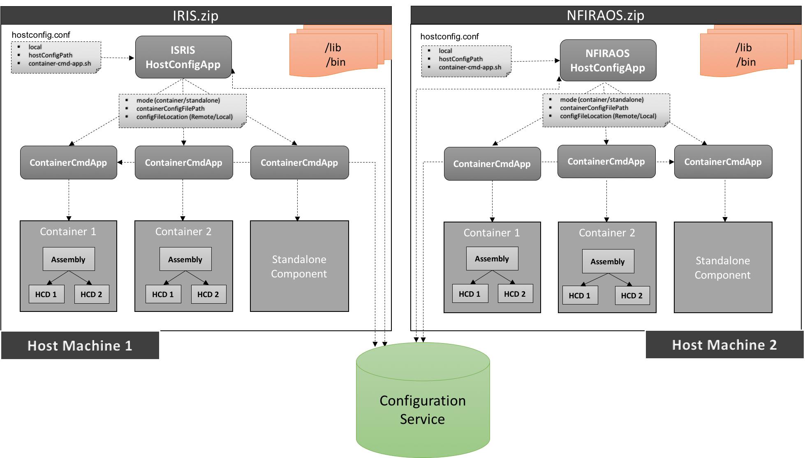

# csw-host-config

This is just a helper to create a host configuration application. 
A component/subsystem is can create their own host configuration application using this helper, 
to be more precise every github repository should have one host configuration application. 
The reason for having one app per repo is, when you run `universal:publish` task,
it will generate zip which will be self contained (will have all the required dependencies) and can be deployed independently on any machine.

This application will start multiple containers on a given host machine and each container will have single/multiple components.

## How to create
Scala
:   @@snip [HostConfigApp.scala](../../../../examples/src/main/scala/example/framework/HostConfigApp.scala) { #host-config-app }

Java
:   @@snip [JHostConfigApp.java](../../../../examples/src/main/java/example/framework/JHostConfigApp.java) { #jhost-config-app }

@@@ note

It is not necessary to have a name of the application as HostConfigApp/JHostConfigApp, user can choose this name.

@@@

## Command line parameter options

* **`--local`** is an optional parameter. When supplied, get the host configuration file from local machine located at hostConfigPath, else fetch it from config service
* **`<file>`** is a mandatory parameter. It specifies Host configuration file path
* **`-s, --container-script <script-path>`** specifies the path of generated shell script of container command app from task `universal:packageBin` (sbt-native-packager task)
* **`--help`** prints the help of the application.
* **`--version`** prints the version of the application.

## Examples

### Pre-requisites

* Run `sbt project/universal:packageBin` command. Here project contains HostConfigApp and ContainerCmdApp and it depends on required components. Ex. Hcd's, Assembly's etc.
* Navigate to `project/target/universal` directory
* Unzip file created with projects name
* Navigate to `bin` directory from unzipped content

Sbt task: `sbt project/universal:packageBin` creates following four scripts in `bin` directory:
 
* `trombone-host-config-app` : Responsible for starting multiple containers. It takes `hostconfig.conf` file as an argument which contains list of container specifications.
* `trombone-container-cmd-app` : Responsible for starting single container or component in standalone mode. It takes `containerConfig.conf` file as an argument which contains single container specifications.
* `trombone-host-config-app.bat` : For windows machine.
* `trombone-container-cmd-app.bat` : For windows machine.

**Examples:**
 
1. 
```
./trombone-host-config-app hostconfig.conf -s ./trombone-container-cmd-app
```  
Fetch `hostconfig.conf` from configuration service which contains multiple container configuration, 
then invoke trombone-container-cmd-app script per container configuration which spawns container

2. 
```
./trombone-host-config-app --local hostconfig.conf -s ./trombone-container-cmd-app
```  
Fetch and parse `hostconfig.conf` from current directory which contains multiple container configuration, 
then invoke trombone-container-cmd-app script per container configuration which spawns container
 

@@@ note

In above examples, we are passing argument: `-s ./trombone-container-cmd-app` to `./trombone-host-config-app`. here `-s` stands for script and following to that is script name, in our case its `trombone-container-cmd-app`.
and if you notice, `trombone-container-cmd-app` does not take container configuration file.
`hostconfig.conf` passed to `trombone-host-config-app` contains location of container configuration files. Host config app internally parses `hostconfig.conf` and passes container configuration file
location to `trombone-container-cmd-app`.

Find more details of ContainerCmd application @ref:[here](../framework/deploying-components.md).

@@@

 
## Where does it fit in overall deployment strategy (may change)


 
## Custom Host Configuration

hostconfig.conf
:   @@snip [hostConfig.conf](../../../../examples/src/main/resources/hostConfig.conf) { #host-conf }

## Help
Use the following command to get help on the options available with this app
  
`./bin/trombone-host-config-app --help`

## Version
Use the following command to get version information for this app
  
`./bin/trombone-host-config-app --version`

@@@ note

Before running `host-config` app, make sure that `csw-location-server` is running on local machine at `localhost:7654`.
As host config application internally executes `container-cmd` application which uses local HTTP location client which expect location server running locally.

@@@


## Systemd configuration

Using systemd, you can configure host configuration application to spawn containers on a machine to be run automatically on system startup.

For detailed information on systemd configuration, please refer to @github[readme.md](/tools/systemd/readme.md) 
