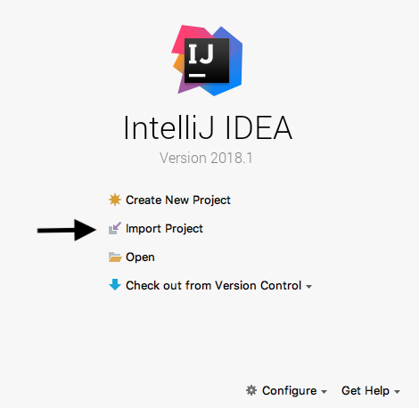
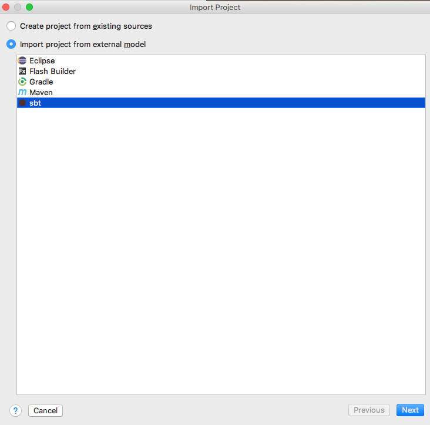
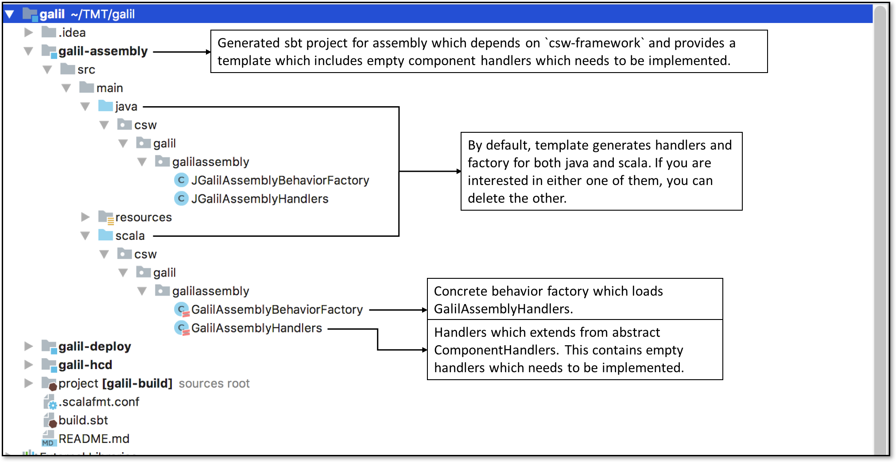
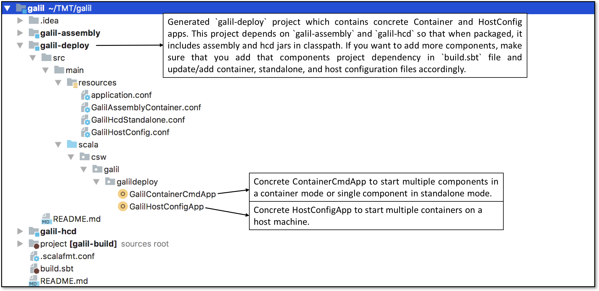

# Getting Started

In this tutorial, you’ll see how to create a Scala/Java project using a [giter8](http://www.foundweekends.org/giter8/) template for CSW ([csw.g8](https://github.com/tmtsoftware/csw.g8)) which contains sample handlers for creating HCD and Assembly. 
It also contains a deploy project which is responsible for starting multiple components or containers. You can use this as a starting point for your own projects for writing component. 
We’ll use the [sbt](http://www.scala-sbt.org/1.x/docs/index.html) build tool which compiles, runs, and tests your projects among other related tasks.

## Installation
Supported Operating Systems are: CentOS and MacOS
 
1.  Make sure you have the Java 8 JDK (also known as 1.8)
    -   Run  `javac -version`  in the command line and make sure you see  `javac 1.8.___`
    -   If you don’t have version 1.8 or higher,  [install the JDK](http://www.oracle.com/technetwork/java/javase/downloads/index.html)
2.  Install sbt
    -   [Mac](http://www.scala-sbt.org/1.x/docs/Installing-sbt-on-Mac.html)
    -   [Linux](http://www.scala-sbt.org/1.x/docs/Installing-sbt-on-Linux.html)
3. Install IntelliJ 
	- [MAC](https://www.jetbrains.com/idea/download/#section=mac)
	- [Linux](https://www.jetbrains.com/idea/download/#section=linux)
4. Install following IntelliJ Plugins
    - [Scala](https://plugins.jetbrains.com/plugin/1347-scala)
    - [Scalafmt](https://plugins.jetbrains.com/plugin/8236-scalafmt)
5. Recommended testing frameworks/tools: 
	- [ScalaTest](http://www.scalatest.org/)
	- [JUnit](https://junit.org/junit4/), JUnit Interface
	- Note: These frameworks are typically downloaded and made available by the sbt tool by specifying them as dependencies.
	If you are using the [giter8](https://github.com/tmtsoftware/csw.g8) template (see below), these dependencies are specified by default, and the sbt
	will resolve them when it runs.  


## Create project

1.  `cd`  to an empty folder.
2.  Run the following command  `sbt new tmtsoftware/csw.g8`. This pulls the ‘csw’ template from GitHub.
    If above command fails to pull template, then try running with full path `sbt new https://github.com/tmtsoftware/csw.g8`
3.  Provide input details when prompted. Follow the template [readme.md](https://github.com/tmtsoftware/csw.g8/blob/master/README.md) for detailed information about input parameters.


To open the project in IntelliJ, start IntelliJ and click on Import Project in the Intro dialog.  If you have a project already open, click on File -> New -> Project from Existing Sources...   



Then select the directory created by the template and click Open.

You will then see a dialog asking how to import the project.  



Be sure the Import project from external model radio button and sbt options are selected and click Next.  Then click Finish on the next dialog to accept the defaults.

Let’s take a look at what just got generated:

In this example, a project was created with default parameters. The complete project structure looks like this:

1.  As you can see in below snapshot, template will create three projects:
    - `galil-assembly`
    - `galil-hcd`
    - `galil-deploy`
    


2.  `galil-deploy` project is used to create a concrete implementation.  This allows for the construction of a complete binary
package bundled with all dependencies, and a launching application.


3.  Template comes with `csw-prod` and other useful library dependencies. It also includes bunch of plugins as explained in below snapshot


## Add new sbt project module

If you want to add another component to the project, for example, with the name `galil-io`, you have to create a new sbt module:

1. Add external library dependencies required by `galil-io` in `Libs.scala` file, if it does not exist.
```
val `akka-actor` = "com.typesafe.akka" %% "akka-actor" % "2.5.11"
```
2. Map new/existing library dependencies in `Dependencies.scala` file against new project.
```
val GalilIO = Seq( Libs.`akka-actor` )
```
3. Include below snippet in `build.sbt` file, this will create new sbt project module.
```
lazy val `galil-io` = project
  .settings( libraryDependencies ++= Dependencies.GalilIO )
``` 
4. If you new module depends on code from other modules within this project, use `.dependsOn` in your build.sbt file:
``` 
lazy val `galil-io` = project
  .settings( libraryDependencies ++= Dependencies.GalilIO )
  .dependsOn(
    `galil-assembly`,
    `galil-hcd`
  )
```
5. Update the deployment dependencies:
``` 
lazy val `galil-deploy` = project
  .dependsOn(
    `galil-assembly`,
    `galil-hcd`,
    `galil-io`
  )
```

