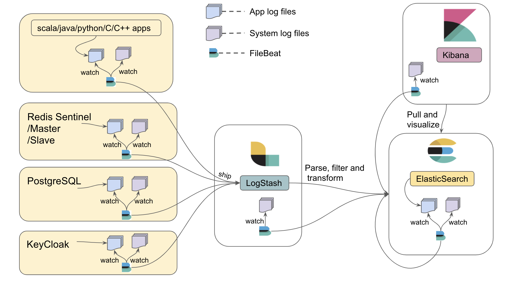

# Logging Aggregator

The logging aggregator provides aggregation of logs generated from TMT applications written in Scala, Java, Python, C, C++, modules like System logs,
Redis logs, Postgres logs, ElasticSearch logs, Keycloak logs using the widely used Elastic [ELK stack](https://www.elastic.co/elk-stack) ([Elasticsearch](https://www.elastic.co/guide/en/elasticsearch/reference/current/index.html),
[Logstash](https://www.elastic.co/guide/en/logstash/current/index.html), [Kibana](https://www.elastic.co/guide/en/kibana/current/index.html)),
and the [Filebeat](https://www.elastic.co/guide/en/beats/filebeat/current/index.html) utility.

@@@ note

The basic/elastic license of Elastic stack, which is a free license, should be sufficient for TMT's purposes. To know 
more about what features are available in the basic license refer this [link](https://www.elastic.co/subscriptions).

@@@

## Architecture

Logstash collects the JSON logs (e.g. from components) in string format, parses it to a valid JSON object and then feeds it to Elasticsearch.
Elasticsearch is responsible for ingesting and indexing the JSON data.
If logs are generated in non-JSON format, which will be the case for Redis, syslog, Postgres, and Elasticsearch logs, they will be parsed and indexed using the elastic 
[modules](https://www.elastic.co/guide/en/beats/filebeat/current/filebeat-modules-overview.html). 

After the JSON data is indexed in Elasticearch, Kibana provides powerful visualization tools and dashboards that offer various interactive diagrams to visualize complex queries. 

Filebeat is responsible for watching log files and shipping it to the centralized Logstash component.
As shown in the above architecture diagram, all machines in TMT can run Filebeat to watch log files. 
Filebeat maintains a marker in a registry for the last read position in a file,
so that it can resume where it left off should it need to be restarted. Applications can keep emitting logs to the file 
agnostic to whether Filebeat is running or not.

@@@ note

All the files required for logging aggregator configuration can be found [here](https://github.com/tmtsoftware/csw/tree/master/scripts/logging_aggregator).
How to use each of these files and its significance will be explained further in the document.  For rapid use in a development environment, a Docker image
has been created.  See @ref:[below](#running-elastic-stack-for-developers) for more information.

It is assumed that in production, Elasticsearch, Logstash and Kibana will be registered with TMT intranet DNS setup. Hence, all the configuration files
for production are provided by referring to the DNS host name. 

It is strongly recommended to run the same version (v6.6.0 or higher) of elastic components so as to avoid any compatibility issues.

By default, the elastic stack exposes the following ports on which the configurations rely.
 
 * 5044: Logstash TCP input.
 * 9200: Elasticsearch HTTP port
 * 5601: Kibana

@@@

## Logging from TMT Applications (Scala/Java/Python/C++/C)

In order to aggregate logs generated from TMT apps, the Filebeat application is used to watch them. The recommended practice is for apps to generate log files
at a common place so that Filebeat can find them. This common place is defined by an environment variable `TMT_LOG_HOME`,
 e.g. `TMT_LOG_HOME = /<<user-accessible-space>>/tmt/logs`.

@@@ note

For convenience during development, you may choose to use `/tmp` for `TMT_LOG_HOME`.  However, for production, this variable should 
be set to something more permanent, since all the files in `/tmp` will be lost on machine reboot.

@@@      

The upcoming sections will explain how each TMT application can generate log files at `TMT_LOG_HOME` and how Filebeat can read them:

@@@ note

Things to keep in mind while writing C++/C/Python apps

 * The structure of JSON logs should adhere to @ref:[this](../services/logging.md#log-structure) format
 * Log files should be generated at the path set by `TMT_LOG_HOME`
 * Time should be logged in UTC
 * It is recommended to use rotating files for logging

Scala/Java applications using the CSW Logging framework follow these conventions out of the box.

@@@

### Scala/Java

For Scala/Java applications to dump logs in a file, it is important that developers enable the `FileAppender` in `application.conf`. To know more about how
to configure `FileAppender` please refer the @ref:[logging documentation](../services/logging.md#configuration). Once, the `FileAppender` is enabled, the log files
will be generated under `TMT_LOG_HOME`. If `TMT_LOG_HOME` is not set as an environment variable then a `BaseLogPathNotDefined` exception will be thrown. 
For tests, you can hard code a logging directory without setting the `TMT_LOG_HOME` environment variable by 
overriding the `baseLogPath` configuration setting in the logging configuration in your `application.conf` file.

### C++

For C++ developers, it is recommended to use the [spdlog](https://github.com/gabime/spdlog) library along with 
[spdlog-setup](https://github.com/guangie88/spdlog_setup) add-on library for logging in files.  This add-on allows
`spdlog` to be configured using a file instead of hardcoding it.

The following code snippet will explain how to use `spdlog`:

main.cpp
:   @@snip [main.cpp](../../../../examples/src/main/scala/example/logging/aggregator/cpp/main.cpp)

logging_default.toml
:   @@snip [logging_default.toml](../../../../examples/src/main/scala/example/logging/aggregator/cpp/logging_default.toml)

The source code for above code can be found [here](https://github.com/tmtsoftware/csw/tree/master/examples/src/main/scala/example/logging/aggregator/cpp)

@@@ note

`spdlog-setup` uses the `.toml` file format for its configuration files.  Log levels could be specified in this configuration file so that
they can be changed without re-compiling C/C++ code. 

@@@

### C

For C developers, it is recommended to use [zlog](https://github.com/HardySimpson/zlog) logging library. The following code snippet will explain how to
use `zlog`:

main.c
:   @@snip [main.c](../../../../examples/src/main/scala/example/logging/aggregator/c/main.c)

logging_default.conf
:   @@snip [logging_default.conf](../../../../examples/src/main/scala/example/logging/aggregator/c/logging_default.conf)

The source code for above code can be found [here](https://github.com/tmtsoftware/csw/tree/master/examples/src/main/scala/example/logging/aggregator/c)

@@@ note

`zlog` uses a custom DSL for its configuration.  See [this](https://hardysimpson.github.io/zlog/UsersGuide-EN.html#htoc14) for more information.

@@@

### Python

For python developers it is recommended to use the default `python-logging` module that comes with python. The following code snippet will explain how to
use `python-logging` with python 3.7:

main.py
:   @@snip [main.py](../../../../examples/src/main/scala/example/logging/aggregator/python/main.py)

logging_default.json
:   @@snip [logging_default.json](../../../../examples/src/main/scala/example/logging/aggregator/python/logging_default.json)

tmt_formatter.py
:   @@snip [tmt_formatter.py](../../../../examples/src/main/scala/example/logging/aggregator/python/tmt_formatter.py)

The source code for above code can be found [here](https://github.com/tmtsoftware/csw/tree/master/examples/src/main/scala/example/logging/aggregator/python)

@@@ note

The above example shows how `tmt_formatter.py` in `logging_default.json` is used to log with UTC timestamps.

@@@

@@@ note

YAML can be used instead of JSON, as well as the simple INI format used in previous versions of python (although with less flexibility).
See the [python documentation](https://docs.python.org/3/howto/logging.html#configuring-logging) for more information.

@@@
   
## Setting up Filebeat to watch TMT app logs and system generated logs

Once TMT applications generate log files under TMT_LOG_HOME, Filebeat needs to start watching them. In order for Filebeat to be aware of TMT_LOG_HOME,
[filebeat.yml](https://github.com/tmtsoftware/csw/blob/master/scripts/logging_aggregator/prod/filebeat/modules/system/filebeat.yml) should be used to
start Filebeat.

All machines running TMT applications also need system generated logs to be watched by Filebeat so that it gets shipped to Logstash. This can be achieved
by enabling the [System module](https://www.elastic.co/guide/en/beats/filebeat/current/filebeat-module-system.html) in Filebeat and making Elasticsearch aware of receiving
system logs (text based logs) to parse and index them.

In order to achieve this, follow the steps given below:

* Run Elasticsearch using [elasticsearch.yml](https://github.com/tmtsoftware/csw/blob/master/scripts/logging_aggregator/prod/elasticsearch/elasticsearch.yml).
  Place `elasticsearch.yml` in <<Elasticsearch installation folder>>/config/ and execute `./bin/elasticsearch` (on Mac) or `bin/elasticsearch` (on Linux).
* Run LogStash using [logstash.conf](https://github.com/tmtsoftware/csw/blob/master/scripts/logging_aggregator/prod/logstash/logstash.conf).
  Place `logstash.conf` in <<Logstash installation folder>>/config/ and execute `./bin/logstash -f config/logstash.conf` (on mac) or
  `bin/logstash -f config/logstash.conf` (on Linux).
* Place [filebeat.yml](https://github.com/tmtsoftware/csw/blob/master/scripts/logging_aggregator/prod/filebeat/modules/system/filebeat.yml)
  in <<Filebeat installation folder>> and execute [filebeat-init.sh](https://github.com/tmtsoftware/csw/blob/master/scripts/logging_aggregator/prod/filebeat/modules/system/filebeat-init.sh)
  from <<Filebeat installation folder>>. This will make Elasticsearch aware of System module.
* Run Filebeat from <<Filebeat installation folder>> by executing `./filebeat -e` (on Mac) or `filebeat -e` (on Linux).
  This will enable system module for watching system logs from its default path i.e. /var/log/system.log as well as watching log files under TMT_LOG_HOME.
* Run Kibana using [kibana.yml](https://github.com/tmtsoftware/csw/blob/master/scripts/logging_aggregator/prod/kibana/kibana.yml). 
  Place `kibana.yml` in <<Kibana installation folder>>/config/ and execute `./bin/kibana` (on mac) or `bin/kibana` (on Linux). This will give GUI over
  logs aggregated in Elasticsearch.

@@@ note
 
It is assumed that in production, Elasticsearch, Logstash and Kibana will be registered with TMT intranet DNS setup. Hence, all the [configuration files]
(https://github.com/tmtsoftware/csw/tree/master/scripts/logging_aggregator/prod)
for production are provided by referring to DNS host name. 
 
@@@

## Redis logs

In production, Redis will be started in sentinel mode, master mode and slave mode on different machines for Event and Alarm service. [Configuration files]
(https://github.com/tmtsoftware/csw/tree/master/scripts/conf)
are provided for Redis sentinel, master and slave to log in file `/var/log/redis/redis-server.log` (user needs to uncomment `logfile` path in conf files).
Filebeat will also be watching this file once the [Redis module](https://www.elastic.co/guide/en/beats/filebeat/6.7/filebeat-module-redis.html) is
enabled.

Note that system generated logs on Redis machines also needs to be watched by Filebeat and aggregated. In order to enable Redis and System module
follow the below given steps: 

* Run Elasticsearch using [elasticsearch.yml](https://github.com/tmtsoftware/csw/blob/master/scripts/logging_aggregator/prod/elasticsearch/elasticsearch.yml).
  Place `elasticsearch.yml` in <<Elasticsearch installation folder>>/config/ and execute `./bin/elasticsearch` (on Mac) or `bin/elasticsearch` (on Linux).
* Run LogStash using [logstash.conf](https://github.com/tmtsoftware/csw/blob/master/scripts/logging_aggregator/prod/logstash/logstash.conf).
  Place `logstash.conf` in <<Logstash installation folder>>/config/ and execute `./bin/logstash -f config/logstash.conf` (on mac) or
  `bin/logstash -f config/logstash.conf` (on Linux).
* Place [filebeat.yml](https://github.com/tmtsoftware/csw/blob/master/scripts/logging_aggregator/prod/filebeat/modules/redis/filebeat.yml)
  in <<Filebeat installation folder>> and execute [filebeat-init.sh](https://github.com/tmtsoftware/csw/blob/master/scripts/logging_aggregator/prod/filebeat/modules/redis/filebeat-init.sh)
  from <<Filebeat installation folder>>. This will make Elasticsearch aware of Redis and System module.
* Run Filebeat from <<Filebeat installation folder>> by executing `./filebeat -e` (on Mac) or `filebeat -e` (on Linux).
* Run Kibana using [kibana.yml](https://github.com/tmtsoftware/csw/blob/master/scripts/logging_aggregator/prod/kibana/kibana.yml). 
  Place `kibana.yml` in <<Kibana installation folder>>/config/ and execute `./bin/kibana` (on mac) or `bin/kibana` (on Linux). This will give GUI over
  logs aggregated in Elasticsearch.

## Postgres logs

Logs generated by Postgres needs to be watched by Filebeat and aggregated. Hence, use [postgres.conf](https://github.com/tmtsoftware/csw/blob/master/scripts/conf/database_service/postgres.conf)
to start the PostgreSQL server which will enable logging in postgres to its default location `/usr/local/var/postgres` and use UTC time for logging.

Note that system generated logs on Postgres machine also needs to be watched by Filebeat and aggregated. In order to enable Postgres and System module
follow the below given steps: 

* Run Elasticsearch using [elasticsearch.yml](https://github.com/tmtsoftware/csw/blob/master/scripts/logging_aggregator/prod/elasticsearch/elasticsearch.yml).
  Place `elasticsearch.yml` in <<Elasticsearch installation folder>>/config/ and execute `./bin/elasticsearch` (on Mac) or `bin/elasticsearch` (on Linux).
* Run LogStash using [logstash.conf](https://github.com/tmtsoftware/csw/blob/master/scripts/logging_aggregator/prod/logstash/logstash.conf).
  Place `logstash.conf` in <<Logstash installation folder>>/config/ and execute `./bin/logstash -f config/logstash.conf` (on mac) or
  `bin/logstash -f config/logstash.conf` (on Linux).
* Place [filebeat.yml](https://github.com/tmtsoftware/csw/blob/master/scripts/logging_aggregator/prod/filebeat/modules/postgresql/filebeat.yml)
  in <<Filebeat installation folder>> and execute [filebeat-init.sh](https://github.com/tmtsoftware/csw/blob/master/scripts/logging_aggregator/prod/filebeat/modules/postgresql/filebeat-init.sh)
  from <<Filebeat installation folder>>. This will make Elasticsearch aware of Postgres and System module.
* Run Filebeat from <<Filebeat installation folder>> by executing `./filebeat -e` (on Mac) or `filebeat -e` (on Linux).
* Run Kibana using [kibana.yml](https://github.com/tmtsoftware/csw/blob/master/scripts/logging_aggregator/prod/kibana/kibana.yml). 
  Place `kibana.yml` in <<Kibana installation folder>>/config/ and execute `./bin/kibana` (on mac) or `bin/kibana` (on Linux). This will give GUI over
  logs aggregated in Elasticsearch.

## Elasticsearch logs

It is important to also aggregate logs generated by Elasticsearch. There can be situations where indexing generates error and it will be useful to have
those errors aggregated and viewed in Kibana. Hence, use [elaticsearch.yml](https://github.com/tmtsoftware/csw/blob/master/scripts/logging_aggregator/prod/elasticsearch/elasticsearch.yml)
to start Elasticsearch which will configure log file location under `TMT_LOG_HOME`.

Note that system generated logs on Elasticsearch machine also needs to be watched by Filebeat and aggregated. In order to enable Elasticsearch and System
module follow the below given steps:

* Run Elasticsearch using [elasticsearch.yml](https://github.com/tmtsoftware/csw/blob/master/scripts/logging_aggregator/prod/elasticsearch/elasticsearch.yml).
  Place `elasticsearch.yml` in <<Elasticsearch installation folder>>/config/ and execute `./bin/elasticsearch` (on Mac) or `bin/elasticsearch` (on Linux).
* Run LogStash using [logstash.conf](https://github.com/tmtsoftware/csw/blob/master/scripts/logging_aggregator/prod/logstash/logstash.conf).
  Place `logstash.conf` in <<Logstash installation folder>>/config/ and execute `./bin/logstash -f config/logstash.conf` (on mac) or
  `bin/logstash -f config/logstash.conf` (on Linux).
* Place [filebeat.yml](https://github.com/tmtsoftware/csw/blob/master/scripts/logging_aggregator/prod/filebeat/modules/elasticsearch/filebeat.yml)
  in <<Filebeat installation folder>> and execute [filebeat-init.sh](https://github.com/tmtsoftware/csw/blob/master/scripts/logging_aggregator/prod/filebeat/modules/elasticsearch/filebeat-init.sh)
  from <<Filebeat installation folder>>. This will make Elasticsearch aware of it's own module and System module.
* Run Filebeat from <<Filebeat installation folder>> by executing `./filebeat -e` (on Mac) or `filebeat -e` (on Linux).
  This will enable elasticsearch and system module.
* Run Kibana using [kibana.yml](https://github.com/tmtsoftware/csw/blob/master/scripts/logging_aggregator/prod/kibana/kibana.yml). 
  Place `kibana.yml` in <<Kibana installation folder>>/config/ and execute `./bin/kibana` (on mac) or `bin/kibana` (on Linux). This will give GUI over
  logs aggregated in Elasticsearch.

## Keycloak logs

Logs generated from Keycloak needs to be watched by Filebeat and aggregated. Hence, use [standalone.xml](https://github.com/tmtsoftware/csw/blob/master/scripts/conf/auth_service/standalone.xml)
to start JBoss server which will make JBoss server to log in JSON format, enable keycloak logs, and generate log files under `TMT_LOG_HOME`.

Note that system generated logs on Keycloak machine also needs to be watched by Filebeat and aggregated. In order to watch Keycloak logs from 
`TMT_LOG_HOME` and enable system module refer the steps from @ref:[here](logging_aggregator.md#filebeat-watching-tmt-app-logs-and-system-generated-logs).  

## System logs on Logstash and Kibana machines

Machines running Logstash and Kibana will require to aggregate system logs from their machines too. Hence, in order to enable system module on their
machines follow the below given steps:

* Run Elasticsearch using [elasticsearch.yml](https://github.com/tmtsoftware/csw/blob/master/scripts/logging_aggregator/prod/elasticsearch/elasticsearch.yml).
  Place `elasticsearch.yml` in <<Elasticsearch installation folder>>/config/ and execute `./bin/elasticsearch` (on Mac) or `bin/elasticsearch` (on Linux).
* Go to <<Filebeat installation folder>> place [Logstash/filebeat.yml](https://github.com/tmtsoftware/csw/tree/master/scripts/logging_aggregator/prod/logstash/filebeat.yml) 
  and execute [Logstash/filebeat-init.sh](https://github.com/tmtsoftware/csw/tree/master/scripts/logging_aggregator/prod/logstash/filebeat-init.sh) or
  place [Kibana/filebeat.yml](https://github.com/tmtsoftware/csw/tree/master/scripts/logging_aggregator/prod/kibana/filebeat.yml)
  and execute [Kibana/filebeat-init.sh](https://github.com/tmtsoftware/csw/tree/master/scripts/logging_aggregator/prod/kibana/filebeat-init.sh) 
  from Logstash or Kibana machines respectively. This will make Elasticsearch aware of System module.
* Run Filebeat from <<Filebeat installation folder>> by executing `./filebeat -e` (on Mac) or `filebeat -e` (on Linux).
* Run LogStash using [logstash.conf](https://github.com/tmtsoftware/csw/blob/master/scripts/logging_aggregator/prod/logstash/logstash.conf).
  Place `logstash.conf` in <<Logstash installation folder>>/config/ and execute `./bin/logstash -f config/logstash.conf` (on mac) or
  `bin/logstash -f config/logstash.conf` (on Linux).
* Run Kibana using [kibana.yml](https://github.com/tmtsoftware/csw/blob/master/scripts/logging_aggregator/prod/kibana/kibana.yml). 
  Place `kibana.yml` in <<Kibana installation folder>>/config/ and execute `./bin/kibana` (on mac) or `bin/kibana` (on Linux). This will give GUI over
  logs aggregated in Elasticsearch.

## Explore Kibana

Once Kibana is up and running, open `http://localhost:5601/` in a browser and go to:
                              
* `Management` -> `Kibana` ->  `Index Patterns` and create an index pattern as per the requirement.
* `Discover` -> `Select the index pattern created` and explore

For Modules like System, Postgres, Redis and Elasticsearch go to `Dashboard` and explore.

## Running Elastic Stack for Developers

For development purposes [Docker compose](https://docs.docker.com/compose/) is used to start Elasticsearch, Logstash, Kibana and Filebeat in a container.
Hence, make sure that latest Docker setup is installed and running before starting the Elastic stack. The Docker container is responsible for aggregating logs
generated in `tmp/csw/logs`. Hence, developers writing Scala/Java/Python/C++/C applications need to generate log files under `/tmp/csw/logs`. 

Also, note that csw apps started via `csw-services.sh` will generate log files under `/tmp/csw/logs` and thus, it will be aggregated by the Elastic docker container.
To know more about setting up docker and starting Elastic please refer @ref:[Starting Elastic logging aggregator for Development](apps.md#starting-elk-logging-aggregator-for-development). 

@@@ note

By default, Elasticsearch will run in a read-only mode if the disk it is using is more than 90% full.  This can be configured.
See the [Elasticsearch reference documentation](https://www.elastic.co/guide/en/elasticsearch/reference/current/disk-allocator.html)

@@@