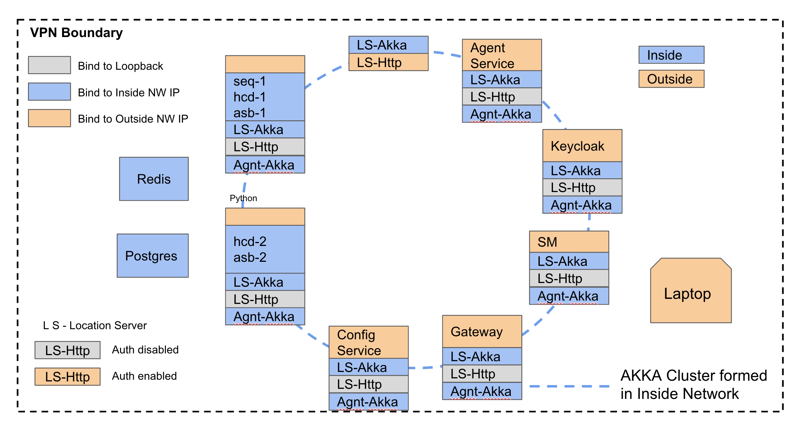

# Network Topology 

There are two network in this network topology.

* Both these networks are withing VPN
* A process/service/component which is accessible within Inside network is not protected by auth.
* A process/service/component which is exposed to Outside network is protected by auth.
* Akka cluster is formed in Inside network
* A machines can connect to both networks using two NICs, if it has a use case, where the application in it
 needs to access both networks.
* A process/service/component running in the machine can choose to bind and register itself to one network even if
 machine itself is connected to both networks. In such cases, the process/service/component can be reached using that
  single network IP only.

## Examples

* Gateway should be accessed in Outside network, hence it is auth enabled and its public IP is registered with location
 service.
* HCD/Assembly should be accessed within Inside network only, hence their private IP is registered with location service

## Terminologies

* Private and inside network means the same thing 
* Public and outiside network means the same thing 

