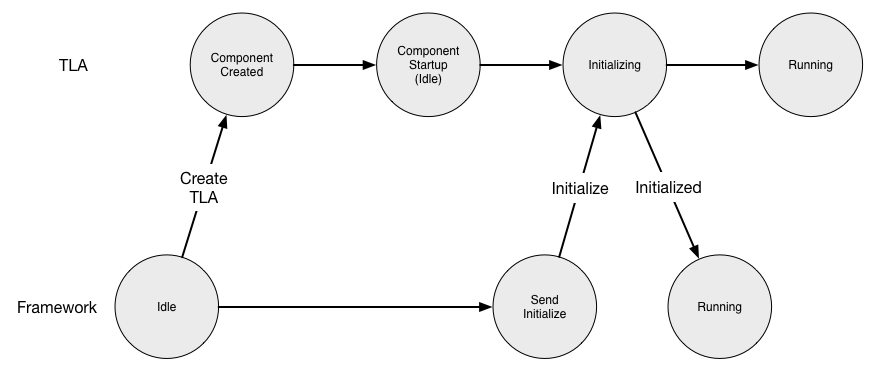

# Component Handlers
A component developer creates a Top Level Actor (TLA) by inheriting from an abstract class 
@scaladoc[ComponentHandlers](csw.framework.scaladsl.ComponentHandlers) or 
@javadoc[JComponentHandlers](csw.framework.javadsl.JComponentHandlers) for Scala or Java, respectively. 
Each of these abstract classes provides several **handler** methods that can be overridden by the developer to provide
component-specific code as described below.  

## Component Lifecycle
For each component, the CSW framework creates a `Supervisor` that creates the TLA, and along with the abstract behavior
class provided by the framework, it starts up and intiailizes the component in a standardized way. At the conclusion of 
the startup of the component, it is ready to receive commands from the outside world. The following figure is used to 
describe the startup lifecycle interactions between the framework and the TLA.

As described in @ref:[Creating a Component](../commons/create-component.md), in either standalone or when running within 
a container, a `Supervisor` is created with a @ref:[ComponentInfo](describing-components.md) file. The figure shows
that the Supervisor in the framework creates the specified TLA. Once the TLA is created, the framework calls the `initialize`
handler. This is the oportunity for the component to perform initialization needed before it is ready to receive commands.

The TLA indicates a successful `initialize` by returning. If it cannot initialize, it can throw an exception, which will be
caught and logged. The Supervisor will retry the creation and initialization of the TLA three times. If it fails after
three times processing stops.

@@@ note
After failing to create and initialize three times, the Supervisor will log a message and stop. In the future when the 
Alarm Service exists, there
will probably be an alarm that will be set to notify the operator of a failure since there is serious problem.
@@@

When `initialize` succeeds, the Supervisor in the framework and the component itself enter the Running state. When in
the Running state, commands received from outside the component are passed to the TLA (see below).

### initialize

The `initialize` handler is invoked when the component is created. This is different than constructor initialization to allow non-blocking 
asynchronous operations. The component can initialize state such as configuration to be fetched from Configuration Service, 
location of components or services to be fetched from Location Service etc. These vary from component to component.

Assembly/Scala
:   @@snip [AssemblyComponentHandlers.scala](../../../../examples/src/main/scala/example/framework/components/assembly/AssemblyComponentHandlers.scala) { #initialize-handler }

Assembly/Java
:   @@snip [JAssemblyComponentHandlers.java](../../../../examples/src/main/java/example/framework/components/assembly/JAssemblyComponentHandlers.java) { #jInitialize-handler }

Hcd/Scala
:   @@snip [HcdComponentHandlers.scala](../../../../examples/src/main/scala/example/framework/components/hcd/HcdComponentHandlers.scala) { #initialize-handler }

Hcd/Java
:   @@snip [JHcdComponentHandlers.java](../../../../examples/src/main/java/example/framework/components/hcd/JHcdComponentHandlers.java) { #jInitialize-handler }

####Creation Timeout
The `Supervisor` waits for the `initialize` to complete. If it times out, it will retry the creation of the TLA
3 times in the same way as with initialize failures. The timeout value is configurable by the TLA by setting the
`initializeTimeout` value in @ref:[ComponentInfo](describing-components.md).

####Location Service Interactions
Once the Supervisor and TLA are in the Running state, the Supervisor registers the component with the Location Service.
This allows the component to be located so it can be contacted. Registration with Location Service happens only if
locationServiceUsage in @ref:[ComponentInfo](describing-components.md) is not set to `DoNotRegister`.

If the component has connections and locationServiceUsage in @ref:[ComponentInfo](describing-components.md) is set to
`RegisterAndTrackServices`, the framework will resolve the components and deliver `TrackingEvent`s to the TLA through
the `onTrackingEvent` @ref:[`onTrackingEvent`](tracking-connections.md) handler. 

## Shutting Down
A component may be shutdown by an external administrative program whether it is deployed in a container or standalone.
Shutting down may occur when the component is `Running`/`onLine` or `offLine` (see below).

The TLA provides a handler called `onShutdown` that is called by the Supervisor when shutting down to give the TLA an opportunity to perform
any clean up it may require such as freeing resources.

As with `initialize` the framework will only wait for 10 seconds for the component to return from `doShutdown`.
If it does not return, it is assumed the TLA is damaged. After successful return from `doShutdown`, the
Supervisor deletes the component. The `doShutdown` timeout cannot be changed.

### onShutdown

The `onShutdown` handler can be used for carrying out the tasks which will allow the component to shutdown gracefully. 

Assembly/Scala
:   @@snip [AssemblyComponentHandlers.scala](../../../../examples/src/main/scala/example/framework/components/assembly/AssemblyComponentHandlers.scala) { #onShutdown-handler }

Assembly/Java
:   @@snip [JAssemblyComponentHandlers.java](../../../../examples/src/main/java/example/framework/components/assembly/JAssemblyComponentHandlers.java) { #onShutdown-handler }

Hcd/Scala
:   @@snip [HcdComponentHandlers.scala](../../../../examples/src/main/scala/example/framework/components/hcd/HcdComponentHandlers.scala) { #onShutdown-handler }

Hcd/Java
:   @@snip [JHcdComponentHandlers.java](../../../../examples/src/main/java/example/framework/components/hcd/JHcdComponentHandlers.java) { #onShutdown-handler }

### Restarting
A component may be restarted by an external administrative program whether it is deployed in a container or standalone.
A restart may occur when the component is `Running`/`onLine` or `offLine` (see below).

A `restart` causes the component to be destroyed and re-created with a new TLA. The `onShutdown`
handler is called to allow the component to tidy up before it is destroyed. Then the Supervisor
creates a new TLA and the startup proceeds as with `initialize` above.

## Component Online and Offline
`Online` describes a component that is currently part of the observing system that is in use. 
When a component enters the Running state it is also "online".

A component is `offline` when it is operating and available for active observing but is not currently
in use.

If a component is to transition from the online state to the offline state, the `onGoOffLine`
handler is called. The component should make any changes in its operation for offline use.

If a component is to transition from the offline state to the online state, the `onGoOnline`
handler is called. The component should make any changes in its operation needed for online use.

### isOnline

A component has access to the `isOnline` boolean flag, which can be used to determine if the component is in the online or offline state.

### onGoOffline

A component can be notified to run in offline mode in case it is not in use. The component can change its behavior if needed as a part of this handler.

Assembly/Scala
:   @@snip [AssemblyComponentHandlers.scala](../../../../examples/src/main/scala/example/framework/components/assembly/AssemblyComponentHandlers.scala) { #onGoOffline-handler }

Assembly/Java
:   @@snip [JAssemblyComponentHandlers.java](../../../../examples/src/main/java/example/framework/components/assembly/JAssemblyComponentHandlers.java) { #onGoOffline-handler }

Hcd/Scala
:   @@snip [HcdComponentHandlers.scala](../../../../examples/src/main/scala/example/framework/components/hcd/HcdComponentHandlers.scala) { #onGoOffline-handler }

Hcd/Java
:   @@snip [JHcdComponentHandlers.java](../../../../examples/src/main/java/example/framework/components/hcd/JHcdComponentHandlers.java) { #onGoOffline-handler }

### onGoOnline

A component can be notified to run in online mode again in case it was put to run in offline mode. The component can change its behavior if needed as a part of this handler.

Assembly/Scala
:   @@snip [AssemblyComponentHandlers.scala](../../../../examples/src/main/scala/example/framework/components/assembly/AssemblyComponentHandlers.scala) { #onGoOnline-handler }

Assembly/Java
:   @@snip [JAssemblyComponentHandlers.java](../../../../examples/src/main/java/example/framework/components/assembly/JAssemblyComponentHandlers.java) { #onGoOnline-handler }

Hcd/Scala
:   @@snip [HcdComponentHandlers.scala](../../../../examples/src/main/scala/example/framework/components/hcd/HcdComponentHandlers.scala) { #onGoOnline-handler }

Hcd/Java
:   @@snip [JHcdComponentHandlers.java](../../../../examples/src/main/java/example/framework/components/hcd/JHcdComponentHandlers.java) { #onGoOnline-handler }

## Handling commands

The remaining handlers are associated with handling incoming commands. There is a handler
for submit commands called `onSubmit` and a handler for oneway called `onOneway`.

### validateCommand

Whenever a command is received by a component it is first validated. The component should
inspect the command and its parameters to determine if the actions related to the command
can be executed or started. For instance, if an Assembly or HCD can only handle one command
at a time, `validateCommand` should return an return `Invalid` if a second command is received.

A command can be sent as a `Submit` or `Oneway` message to the component. The `onSubmit` and `onOneway` handlers are only
called if `validateCommand` returns `Accepted`. `Oneway` messages return their validation response or indicate the component is
currently locked as a `OnewayResponse`.
The `onSubmit` handler can complete the actions immediately by returning a `SubmitResponse` indicating 
the final response (`Completed`, `CompletedWithResult`, `Error`). If the command actions require time for processing, the `onSubmit` handler 
returns `Started` indicating to the framework that there are long-running actions. 
More information about sending commands using `CommandService` is @ref:[here](../commons/command.md)

Assembly/Scala
:   @@snip [AssemblyComponentHandlers.scala](../../../../examples/src/main/scala/example/framework/components/assembly/AssemblyComponentHandlers.scala) { #validateCommand-handler }

Assembly/Java
:   @@snip [JAssemblyComponentHandlers.java](../../../../examples/src/main/java/example/framework/components/assembly/JAssemblyComponentHandlers.java) { #validateCommand-handler }

Hcd/Scala
:   @@snip [HcdComponentHandlers.scala](../../../../examples/src/main/scala/example/framework/components/hcd/HcdComponentHandlers.scala) { #validateCommand-handler }

Hcd/Java
:   @@snip [JHcdComponentHandlers.java](../../../../examples/src/main/java/example/framework/components/hcd/JHcdComponentHandlers.java) { #validateCommand-handler }
 
If a response can be provided immediately, a final `CommandResponse` such as `CommandCompleted` or `Error` can be sent from this handler.

### onSubmit

On receiving a command sent using the `submit` message, the `onSubmit` handler is invoked for a component only if the `validateCommand` handler returns `Accepted`. 
The `onSubmit` handler returns a `SubmitResponse` indicating if the command is completed immediately, or if it is long-running by returning a `Started` response. 
The example shows one way to process `Setup` and `Observe` commands separately.

Assembly/Scala
:   @@snip [AssemblyComponentHandlers.scala](../../../../examples/src/main/scala/example/framework/components/assembly/AssemblyComponentHandlers.scala) { #onSubmit-handler }

Assembly/Java
:   @@snip [JAssemblyComponentHandlers.java](../../../../examples/src/main/java/example/framework/components/assembly/JAssemblyComponentHandlers.java) { #onSubmit-handler }

### onOneway

On receiving a command as `oneway`, the `onOneway` handler is invoked for a component only if the `validateCommand` handler returns `Accepted`.
The `onOneway` handler does not return a value and a command submitted with the `oneway` does not track completion of actions. 

Assembly/Scala
:   @@snip [AssemblyComponentHandlers.scala](../../../../examples/src/main/scala/example/framework/components/assembly/AssemblyComponentHandlers.scala) { #onOneway-handler }

Assembly/Java
:   @@snip [JAssemblyComponentHandlers.java](../../../../examples/src/main/java/example/framework/components/assembly/JAssemblyComponentHandlers.java) { #onOneway-handler }

More information on handling commands is provided @ref:[here](../commons/command.md).