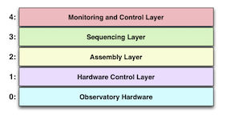

# TMT Common Software (CSW)

@@@ index
 - [Getting Started](commons/getting-started.md)
 - [Creating a Component](commons/create-component.md)
 - [Working with Multiple Components](commons/multiple-components.md)
 - [Using Alarms](commons/using-alarms.md)
 - [Adding Unit Tests](commons/unit-tests.md)
 - [Messages](commons/messages.md)
 - [Framework](commons/framework.md)
 - [Commands](commons/command.md)
 - [Services](commons/services.md)
 - [Applications](commons/apps.md)
 - [Testing](commons/testing.md)
 - [sbt tasks](commons/sbt-tasks.md)
 - [Manuals](commons/manuals.md)
@@@

Common Software is the package of services and infrastructure software that integrates the TMT software systems.

Visit [TMT website](http://www.tmt.org) to know more about Thirty Meter Telescope.

## Common Software Architecture

CSW is designed to support the Observing Mode-Oriented Architecture (OMOA). An observing mode is a well-defined 
instrument observing task and an associated set of owned resources, procedures, and capabilities that implement the mode. 
An example observing mode is: IRIS multi-filter integral field spectroscopy using the NFIRAOS adaptive optics unit 
with AO laser guide star correction. An instrument will generally have several associated observing modes 
for acquisition, science objects, and calibrations. Examples of observing mode resources could be an instrument’s hardware 
devices, or the use of a larger system such as the Laser Guide Star Facility.

OMOA structures the software as the layers in the following figure. Each layer contains components with specific responsibilities 
described in the following sections. OMOA bypasses the use of standalone “subsystems” (large principal systems) 
for a flatter system that requires less code and allows the software system for an observing mode to optionally 
be more flexibly composed at run-time.

#### Layer 0 - Obseratory Hardware
Layer 0 represents the actual hardware being controlled and the hardware controllers that interface the hardware to the computer systems.
#### Layer 1 - Hardware Control Layer
The lowest layer in the OMOA software system, the Hardware Control Layer, consists of all the controllable hardware that is available 
for use by higher levels of software. A sea of similar software components called Hardware Control Daemons (HCD) at layer 1 
controls the low-level hardware of the telescope, adaptive optics, and instruments.

An HCD is similar to the device driver found in many systems. Each HCD is associated with a networked motion controller, a PLC/PAC, 
or other low-level hardware controller present in Layer 0. Some hardware controllers will support multiple channels. 
An HCD may support a highly cohesive, related set of functionality. 
For instance, one motion controller with 8 axes might handle all the slow moving filters and gratings of an instrument. 
In other cases, the channels of the controller hardware could be associated with unrelated devices. 
If the hardware controller has multiple channels, the HCD supports access to all the channels and must multiplex 
access to the controller and coordinate requests and replies among the clients.
#### Layer 2 - Assembly Layer
The Assembly Layer exists just above the Hardware Control Layer at Layer 2. Software at this layer consists 
of components called Assemblies.
In OMOA, an Assembly represents a device as a collection of hardware that makes sense at the user level. 
Examples of instrument devices are a filter wheel, a deformable mirror, or a detector controller. 
Assemblies often represent user-oriented devices in the software system, but it is not necessary that an Assembly control HCDs.
#### Layer 3 - Sequencing Layer
The Sequencing Layer is Layer 3 in the figure above. Components at this level are called Sequencers or Sequence Components because 
they take complex descriptions of tasks and control and synchronize the actions of the Assemblies to accomplish the tasks.

Sequence Components in this layer share a software interface that allows them to be plugged together to form the sequencing hierarchy 
for a specific observing mode. Individual Sequencers can provide higher-level control of a set of distributed hardware (e.g., init). 
Individual sequencers can be programmable using scripts. There can be one or many Sequence Components in an observing mode sequencer. 
#### Layer 4 - Monitoring and Control Layer
The Monitoring/Control Layer is the layer of software that contains the user interface programs that are used to observe with the telescope. 
At TMT there will be graphical user interfaces for use by observers during observing. 
These applications use the CSW services to control and monitor the system.

## CSW Services
CSW or Common Software provides a shared software infrastructure based on a set of services and associated software for 
integrating individual components in the large observatory software architecture. The components and client applications use a set of 
loosely coupled services, each autonomous with a well-defined interface that hides the service implementation. It also   
provides a standardized communication with the services.
  
### @ref:[Location Service](services/location.md)
The Location Service of TMT Common Software handles application, component, and service registration and discovery
in the distributed TMT software system. When a component (i.e. an Sequencer, Assembly, or HCD) is initializing, it registers
its name along with other information such as interface type and connection information to the
Location Service. The important feature and reason for the Location Service is that details of
connection information should not be hardwired, they should be discovered at runtime.

Location Service is most obviously needed when one component commands another
component. In this case the first component uses the Location Service to get information about
the second component, and uses that information to make a connection. Discovered information
might include a protocol (e.g., HTTP), interface type (e.g., command), or host and port.

### @ref:[Configuration Service](services/config.md)
The Configuration Service (CS) provides a centralized persistent store for “configuration files”
used in the TMT Software System. In this context, a configuration file is a set of values
describing state, initialization values, or other information useful to a component or set of
components. The TCS provides many examples such as look-up tables of various kinds or a set
of pointing model parameters or parameters for setting up a motion controller. Another is the
Alarm Service Configuration File. At the applications level, the GUI used by the
Observing Assistant could provide a button to save offsets between an instrument science field
and its acquisition camera origin. These are the kinds of scenarios that use the Configuration
Service.

The Configuration Service provides the added feature of storing versions of configuration files.
All versions of configuration files are retained providing a historical record of changes for each
configuration file. Components can save today’s version without fear that yesterday’s version will
be lost. If the configuration of a component is inadvertently lost, it will be possible to easily
restore to the most recently saved version or a default version.

### @ref:[Logging Service](services/logging.md)
Logging is the ability of a software component to output a message, usually for diagnostic
purposes. TMT Common Software will provide a Logging Service. Logging should not be
confused with “data logging”, which is usually collection of measured values. 

This log message includes a time of the log message, a severity (INFO), the source of the log
message as a package path in the software, and a formatted text message.
The Logging Service provides the ability to log messages locally to a file or screen and optionally
to a centralized logging aggregator.

The central logging aggregator (not part of this release) provides the capability for all components to log diagnostic
information to a central and optionally persistent store. The logging information is then
aggregated and ordered by timestamp. A coordinated, centralized log can be an extremely
useful tool for diagnosing many types of distributed software problems. Structured logging will be
used with the central logging aggregator.

The Logging Service is unique because it is required early in the lifecycle of a component and
most components and CSW services themselves will want the ability to log information. It is
often necessary to log messages while a component starts up. This means that the
implementation of distributed logging must not depend upon other services (at least if the
independence of services is desired). It also means that distributed logging will need to load
quickly and provide proper behavior if the aggregating logging capability is needed.

The logging API provides familiar features similar to available logging libraries including
logging levels and the ability to dynamically change the component’s logging configuration while
the component is executing. This allows the ability to interactively log more detailed messages when a component encounters problems.

### @ref:[Command Service](commons/command.md)
In the TMT software design, an Application or Sequence Component connects to Assemblies
and causes actions by submitting commands. Assemblies connect to and command HCDs.
The service that provides the command functionality called the Command
Service (CCS).

In TMT, commands require peer-to-peer connections between the component sending a
command and the component receiving the command. There is no reason to directly connect to
a component unless that component will be commanded. The Location Service provides
connection information for components sending commands with CCS.

In the system design each observing mode has a sequencer that consists of one or more OMOA
Sequence Components. Commands flow down through the Sequence Components to the
Assemblies, HCDs and hardware in a hierarchy.

### @ref:[Event Service](services/event.md)
In an event-driven system, an event marks the occurrence of a state change, action, or activity
that is of interest in the system. In TMT many interactions between systems are best viewed as
being event-driven. For instance, Observe Events are used by a science detector to indicate
when activities have occurred such as closing the shutter at the conclusion of a science
observation. The TCS Pointing Assembly sends pointing demand events to mechanisms
throughout the software system.

The Event Service is based on the publish/subscribe messaging paradigm.
One component publishes an event and all components that have subscribed receive the event.
The advantage of this type of message system is that publishers and subscribers are decoupled.
Publishers can publish regardless of whether there are subscribers, and subscribers can
subscribe even if there are no publishers. The relationship between publishers and subscribers
can be one-to-one, one-to-many, many to one, or even many-to-many. Another advantage of 
publish-subscribe systems is that components and systems can startup and stop independently
without requiring special interactions or startup sequences with other systems.
The publish-subscribe pattern also allows the creation of event dependencies between systems
that are difficult to track but must be managed. Dependencies can be passive or active. When a
component subscribes to a topic, but takes no action based on the value it is called a passive
dependency. For instance, a GUI display could subscribe to the current position of an instrument
filter but take no action other than displaying the value.

### @ref:[Alarm Service](services/alarm.md)
An alarm is published to mark an abnormal condition that requires the attention of an operator or
other user. Alarms are not errors, they are conditions that occur asynchronously while
components are executing or inactive. For instance, an alarm could be published to indicate a
hardware limit. An example of this kind of alarm event is a detector temperature that is too high.
Alarms are most valuable to operators and observers who monitor the status of the telescope
systems and the instruments. The control GUIs will include standardized ways for displaying
alarms if needed. The Executive Software provides the observer and operator interfaces for the
purpose of displaying alarms relevant to observing from the instruments and telescope system.

However, **alarms are not a suitable or approved approach to hazard control as part of a
TMT safety system**. Alarms should provide additional information to operators and staff about
systems monitored by the OSS and can provide early warning of future hazardous conditions,
but should not be a sole, primary hazard control.

### @ref:[Database Service](services/database.md)

### @ref:[Framework](commons/framework.md)
The framework provides templates for @ref:[creating](./commons/create-component.md) and running the kind of software components 
defined by TMT as well as service access interfaces for these components. It also provides @ref:[application](./apps/hostconfig.md) support
for running multiple components on a host machine.

The framework also contains the structures that are common to components, such as commands and event structures.

####HTTP-based services API documentation can be found [here](swagger/index.html).
