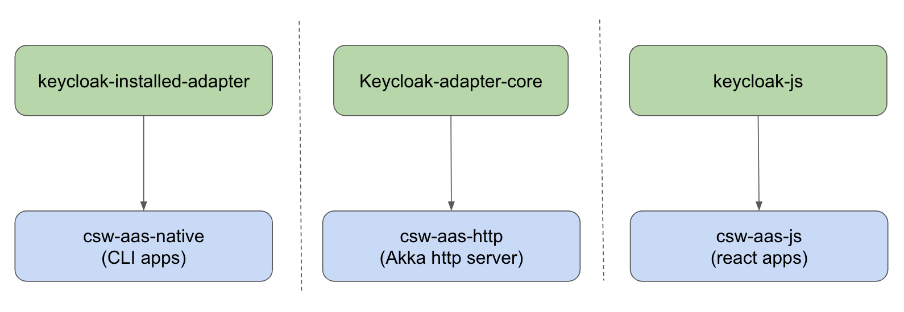

# Authentication and Authorization Service

### Introduction

Authentication and Authorization Service provides suit of libraries which help to enforce authentication and authorization 
for web applications and cli applications in TMT ecosystem.

It provides following libraries (aka adapters). For information on _using_ these adapters, refer following sections:

- @ref:[Akka HTTP Adapter - csw-aas-http](../../services/aas/csw-aas-http.md) - This is adapter which enables security for akka http server applications 
- @ref:[Installed Auth Adapter - csw-aas-installed](../../services/aas/csw-aas-installed.md) - This is adapter which enables security for cli applications 
- @extref[Javascript Adapter - csw-aas-js](csw_js:aas/csw-aas-js) - This is adapter which enables security for javascript react applications

These adapters are written on top of [client adapters](https://www.keycloak.org/docs/latest/securing_apps/index.html#what-are-client-adapters) provided by keycloak.

 

For more information on internals of these adapters refer following sections:

- @ref:[Akka HTTP Adapter - csw-aas-http](./csw-aas-http.md) 
- @ref:[Installed Auth Adapter - csw-aas-installed](./csw-aas-installed.md) 
- @extref[Javascript Adapter - csw-aas-js](csw_js:technical/csw-aas-js) 
