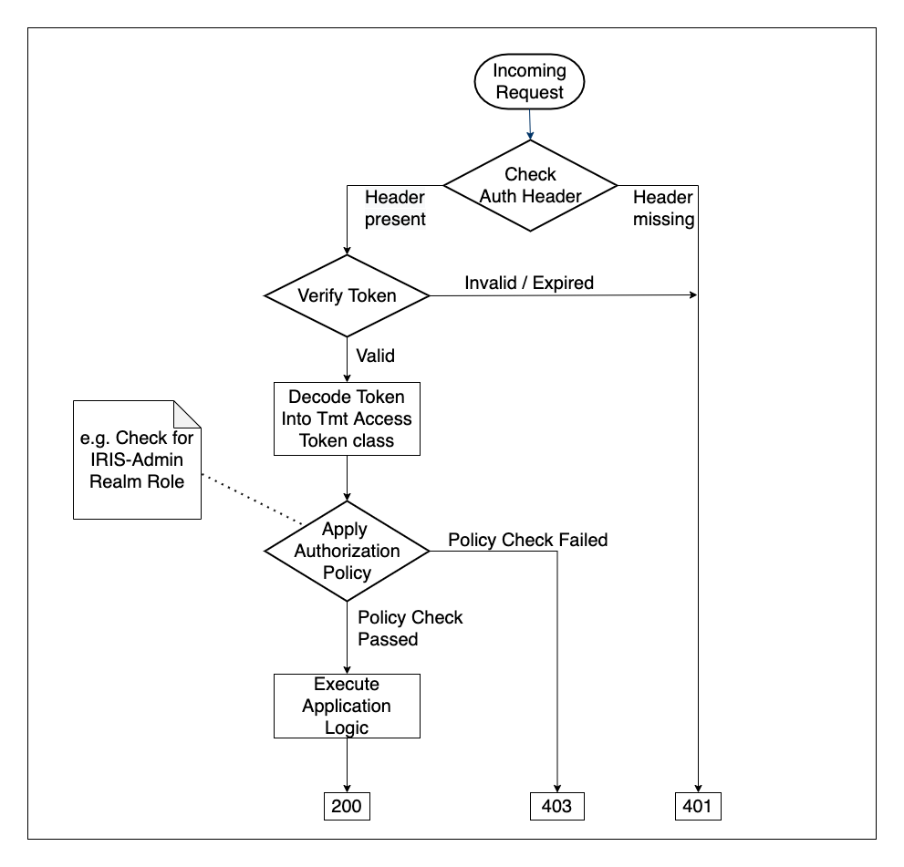

# csw-aas-http - Akka HTTP Adapter 

This is security adapter for akka http server applications. It exposes security directives e.g. sGet, sPost etc which enforce
authentication and authorization based on authorization policies.

In order for akka http server to utilize keycloak it has to be registered as keycloak client. Please refer to [keycloak documentation](https://www.keycloak.org/docs/latest/getting_started/index.html)
for details.

## Types of tokens

###ID Token - 
The ID Token is a JSON Web Token (JWT) that contains user profile information (such as the user's name and email) 
which is represented in the form of claims. These claims are statements about the user, which can be trusted if the consumer of 
the token can verify its signature.

###Access Token - 
An Access Token is a credential that can be used by an application to access an API. Access Tokens can be 
is JSON web token digitally signed using JSON web signature (JWS). They inform the API that the bearer of the token has been 
authorized to access the API and perform specific actions specified by the scope that has been granted.
Access token contains all the information that ID token has. Additionally it has information related to realm and resource roles
associated to user. This information is used for authorization based on clientRole and RealmRole policy.

###Requesting Party Token - 
A requesting party token (RPT) is a JSON web token (JWT) digitally signed using JSON web signature (JWS). 
The token is built based on the OAuth2 access token previously issued by Keycloak to a specific client acting on behalf 
of a user or on its own behalf. RPT contains all the information which access token has, additionally it has information
related to permissions granted. permissions are directly related with the resources/scopes you are protecting. This is used for
authorization based on permission policy.  

## Request flow 

When request comes to secure akka http server, it performs following steps.

1. Authentication - 

Authentication involves verifying and decoding token. Secure http endpoints expect access token to be provided in request header. 
For verification it uses api provided by keycloak-adapter-core. For decoding we are using third party library.
If "enable-permissions" flag is enabled, it involves additional call to keycloak server for fetching RPT using access token provided
in request header. RPT is then decoded using third party library. This completes authentication process. 

2. Authorization -

Role based authorization involves checking access to secure api against roles information present in access token. Permission
based authorization involves checking access to secure api against permissions present in RPT.

Following diagrams shows request flow for secure akka http server.

 
