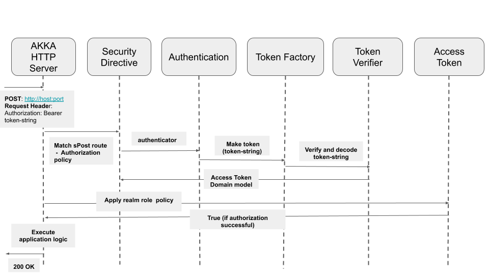

# csw-aas-http - Pekko HTTP Adapter 

This is security adapter for pekko http server applications. It exposes security directives e.g. sGet, sPost etc which enforce
authentication and authorization based on authorization policies.

In order for pekko http server to utilize keycloak it has to be registered as keycloak client. Please refer to [keycloak documentation](https://www.keycloak.org/getting-started/getting-started-zip)
for details.

## Types of tokens

###ID Token - 
The ID Token is a JSON Web Token (JWT) that contains user profile information (such as the user's name and email) 
which is represented in the form of claims.

###Access Token - 
An Access Token is a credential that can be used by an application to access an API. Access Tokens is JSON web token digitally 
signed using JSON web signature (JWS). They inform the API that the bearer of the token has been authorized to access the API and perform 
specific actions specified by the scope that has been granted. Access token contains all the information that ID token has. 
Additionally, it has information related to realm and roles associated to user. This information is used for authorization 
based on RealmRole policy.

## Request flow 

When request comes to secure pekko http server, it performs following steps.

- Authentication 

Authentication involves token verification and decoding. Secure http endpoints expect access token to be provided in request header. 
For verification, it uses api provided by keycloak-adapter-core. For decoding csw-aas-http uses third party library - [jwt-core](https://github.com/jwt-scala/jwt-scala).
Authentication process verifies access token string and decode 
it into `AccessToken` domain model. 

- Authorization

Authorization involves applying specified `AuthorizationPolicy` against `AccessToken`. Foe example, role based authorization 
involves checking access to secure api against roles information present in access token.
 
Following diagrams shows request flow for secure pekko http server.

 

The core of this adapter is the `SecurityDirectives` class. Following diagram shows request flow through different core classes
of this adapter. `SecurityDirecives` provided by this adapter are used while writing pekko http server. For detailing following
diagram shows pekko http server and security directives as separate. Diagram depicts happy flow of POST request secured using realm 
role based authorization policy where server returns 200 OK code. When authentication and authorization is successful, application logic
is executed and 200 OK is returned by server. e.g. create config file if user is authenticated and have admin role. 
In case of errors, server return 401 (unauthorized) or 403 (forbidden) e.g. - If token verification fails for invalid or 
expired token, `TokenVerifier` returns appropriate `TokenVerificationFailure` and pekko http server returns 401. 
If authorization policy check fails then `AccessToken` returns false and then pekko http server return 403.

## Asynchronous nature of Pekko-HTTP Routing layer

csw-aas-http uses `authenticateOAuth2Async` and `authorizeAsync` which are async variants of pekko-http security directives. This allows 
it to run without blocking routing layer of Pekko HTTP, freeing it for other requests.
