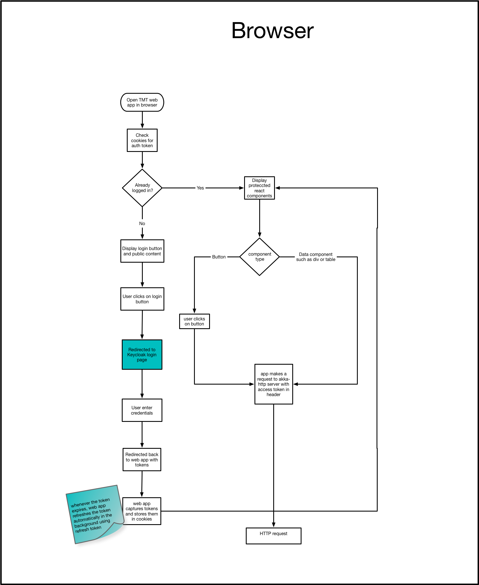

# csw-aas-js - Javascript adapter

csw-aas-js is a npm package which exposes react components to enable authentication and authorization. csw-aas-js is built
on top of [keycloak-js](https://www.keycloak.org/docs/latest/securing_apps/index.html#_javascript_adapter)

In order for web application to utilize keycloak it has to be registered as public keycloak client. Please refer to [keycloak documentation](https://www.keycloak.org/docs/latest/getting_started/index.html)
for details.

## Application Configuration

Web application needs following configurations in order to get access token from keycloak server. This application specific
config object should be passed in AuthContextProvider component. There are two configurations needed for a web application 
i.e. `realm`, `client-id`

`realm` is a mandatory configuration which specified in keycloak server under which client for your application is registered.

`client-id` is a mandatory configuration which specifies the client id of the app as per registration
in keycloak server.

```
{
  realm: 'TMT',
  clientId: 'csw-config-app',
}
```

## Keycloak Instantiation

To call secure end point, web application first needs to be authenticated using keycloak server. There are two options for authentication 
`login-required` and `check-sso`. `login-required` will authenticate if the user is already logged-in to Keycloak or it 
will display keycloak login page. `check-sso` will only authenticate if the user is already logged-in, if the user is not logged-in 
the browser will be redirected back to the application and remain unauthenticated. 

At start of web application csw-aas-js use `check-sso` to instantiate keycloak. It shows secure components if user is already logged in.
If user is not authenticated Login component is rendered. If user clicks on login button it instantiates keyclock use `login-required`. This redirects 
user to keycloak login page. As access token has very short life span, at time of keycloak instantiation csw-aas-js also adds hooks to refresh
token. This gives seamless user experience as user need not to login again.

After the user is authenticated the application can make requests to RESTful services secured by Keycloak by including the bearer token in the Authorization header.

## Authorization flows

Keycloak supports three authorization flows e.g. authorization code flow, implicit flow and hybrid flow.
csw-aas-js has chosen to go with hybrid flow as it has better performance than authorization code flow and unlike implicit flow
hybrid flow makes refresh token available to application. For more information please refer [keyclok documentaion for authorization flows](https://www.keycloak.org/docs/latest/securing_apps/index.html#_javascript_implicit_flow)

## Working of web application

Following diagram explains javascript application flow for making request to secure http api

  


