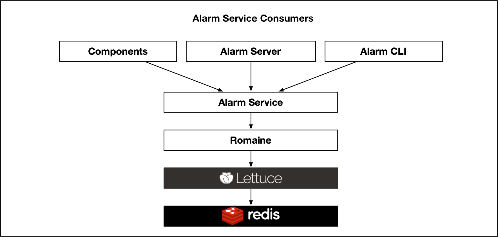
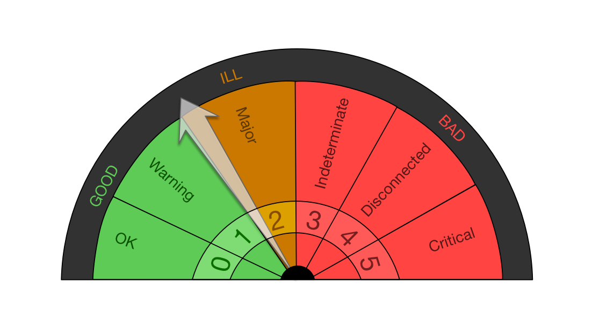
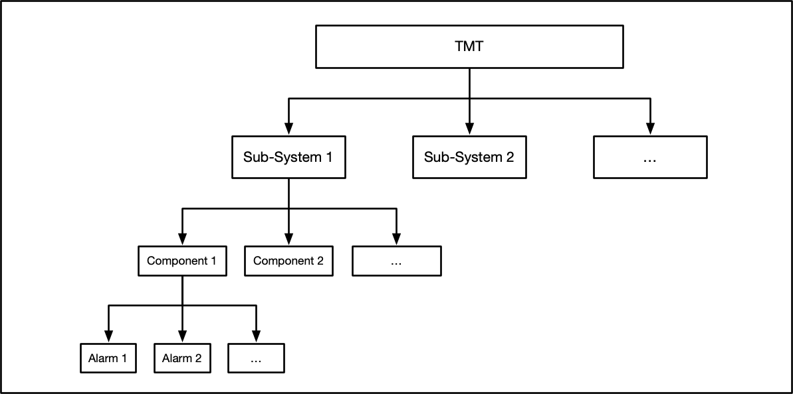
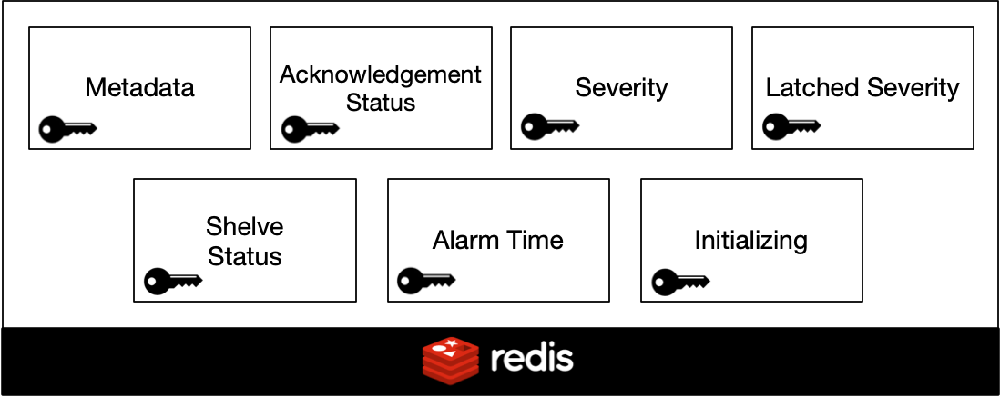
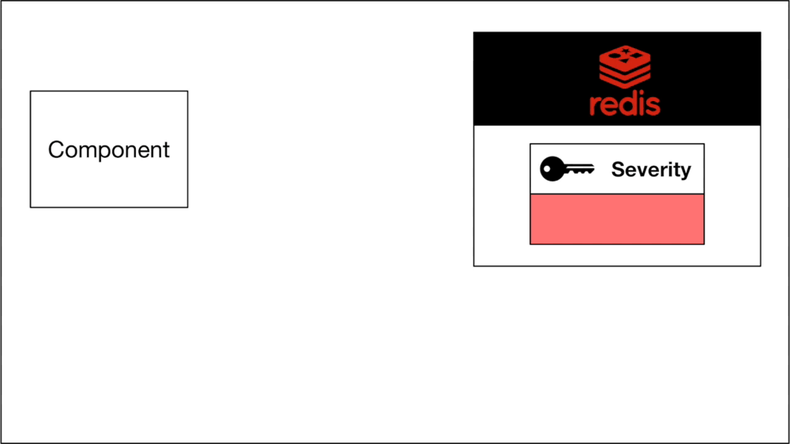
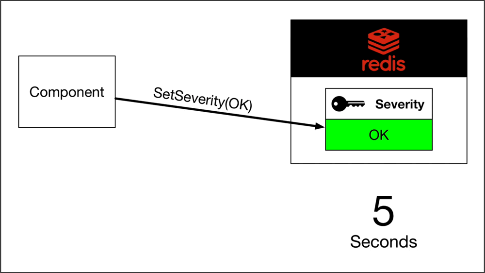
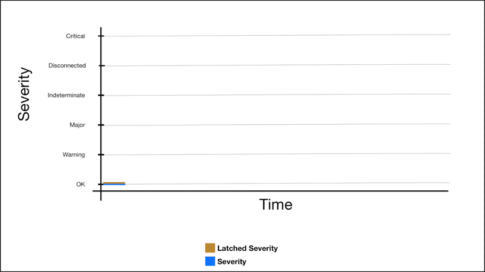
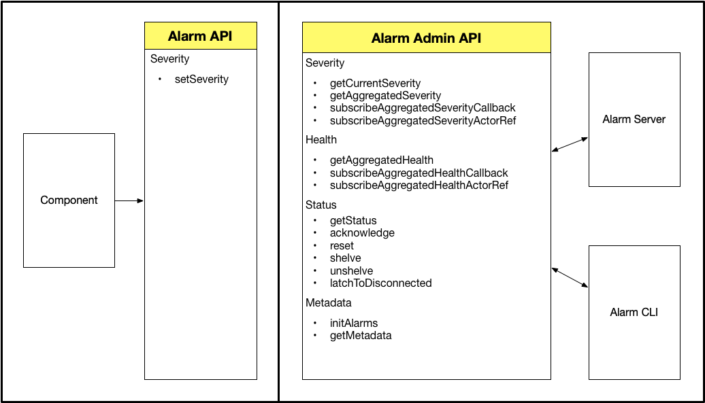
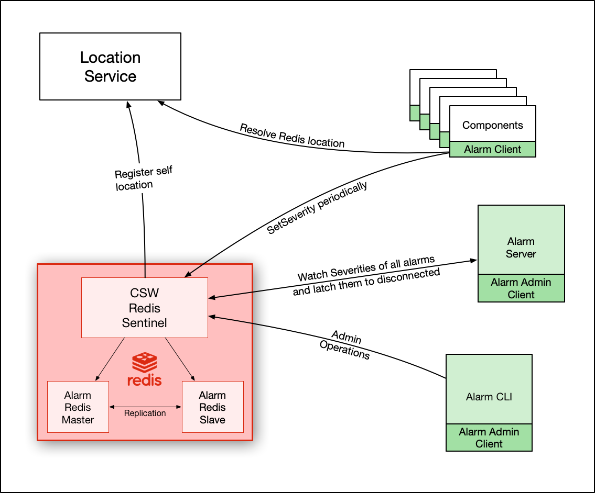

# Alarm Service

## Introduction

Alarm service in TMT software is used by components to raise alarms. 
Alarms could be of different severities such as Warning, Critical, etc. 
The alarm system also provides mechanism to monitor the health of all components 
and subsystems in TMT.

## Technology

Alarm service uses [Redis](https://redis.io/) for persistence. Redis provides 
[Keyspace Notifications](https://redis.io/topics/notifications) which allows clients to subscribe to Pub/Sub channels 
in order to receive events affecting the Redis data set in some way.



We have created a layer i.e. "Romaine" which converts redis events into an [akka stream](https://doc.akka.io/docs/akka/current/stream/index.html).
Romaine internally uses a java redis library called [Lettuce](https://lettuce.io/).

## Severities

An alarm can have one of the following severities at a given time

| Severity Name  | Severity Level  |
|---:|:---:|
| `Okay`  | 0  |
| `Warning`  | 1  |
| `Major`  |  2 |
| `Indeterminate`  | 3  |
| `Disconnected`  | 4  |
| `Critical`  |  5 |

## Health

Health is a higher level abstraction created on top of severities. An alarm can have one of the 
following heaths at a given time.

- `Good`
- `Ill`
- `Bad`
 
Health is calculated based on severity. A mapping between health and 
severities is shown in the figure below.



## Severity & Health Aggregations

A severity can be associated with an alarm, a component or a sub-system.

Unlike alarms, which has a direct association with severity, components 
and sub-systems don't have a direct association with severities. 
They have aggregated severities based on severities of their children.



A components aggregated severity is equal to severity of it's child alarm with "maximum" severity.
Similarly, a sub-system's aggregated severity is determined by it's child component with maximum severity.

Health aggregation works on top of severity aggregation. A components aggregated health is calculated by first
calculating it's aggregated severity and then mapping it to health. Sub-System health aggregation works in the same way.

## Redis Storage



### Metadata

Metadata of an alarm is static information about an alarm such as name, 
description, subsystem, component, etc. This information is not changed during runtime.
Since the metadata is static, entire metadata of an alarm is stored against a single redis key in json format for easy retrieval.
The key name is formed with pattern: `metadata-[SUBSYSTEM_NAME]-[COMPONENT_NAME]-[ALARM_NAME]` 
e.g. `metadata-nfiraos-trombone-tromboneaxislowlimitalarm`.

The sample json below, shows structure of typical alarm metadata

```json
{
   "subsystem":"tcs",
   "component":"corrections",
   "name":"outOfRangeOffload",
   "description":"Another system has sent an out of range offload that has caused the system to go into a bad state!",
   "location":"Computer Room",
   "alarmType":"absolute",
   "supportedSeverities":[
      "warning",
      "major",
      "indeterminate",
      "okay"
   ],
   "probableCause":"Bad software in NFIRAOS or WFOS",
   "operatorResponse":"Reset the software system and hope",
   "isAutoAcknowledgeable":false,
   "isLatchable":true,
   "activationStatus":"active"
}
```

### Acknowledgement Status

Indicates Acknowledgement status of an alarm. The key name is formed with pattern `ackstatus-[SUBSYSTEM_NAME]-[COMPONENT_NAME]-[ALARM_NAME]`.
e.g. ackstatus-nfiraos-enclosure-temphighalarm

Possible values of this key are: 

- `acknowledged`
- `unacknowledged`

### Severity

Indicates the current severity of an alarm. The key name is formed with pattern 
`severity-[SUBSYSTEM_NAME]-[COMPONENT_NAME]-[ALARM_NAME]`.  
e.g. `severity-nfiraos-trombone-tromboneaxislowlimitalarm`

This key can contain one of the following values at a given time -

- `okay`
- `warning`
- `major`
- `indeterminate`
- `critical`

If the value is not present, it is considered to have `disconnected` severity.

### Latched Severity

Indicates the severity on which the current alarm is latched. A latched severity is the max severity of an alarm since last reset operation.
The key name is formed with pattern `latchedseverity-[SUBSYSTEM_NAME]-[COMPONENT_NAME]-[ALARM_NAME]`. e.g. `latchedseverity-tcs-tcspk-cpuexceededalarm`

Possible values of this key are: 

- `okay`
- `warning`
- `major`
- `indeterminate`
- `critical`
- `disconnected`

### Shelve Status

Indicates shelve status of an alarm. The key name is formed with pattern 
`shelvestatus-[SUBSYSTEM_NAME]-[COMPONENT_NAME]-[ALARM_NAME]`.  e.g. `shelvestatus-nfiraos-trombone-tromboneaxislowlimitalarm`

This key can have one of the following values

- `shelved`
- `unshelved`

If no value is present, it is inferred as `unshelved`

### Alarm Time

Indicates the time since last severity change of an alarm. The key name is formed with pattern 
`alarmtime-[SUBSYSTEM_NAME]-[COMPONENT_NAME]-[ALARM_NAME]`. e.g. `alarmtime-nfiraos-beamsplitter-splitterlimitalarm`

The value is stored in the format: `2019-04-03T11:09:28.404143Z`

### Initializing

Indicates whether alarm is initializing or it's initialization is finished. It contains a boolean value either `true` or `false`

The key name is formed with pattern 
`initializing-[SUBSYSTEM_NAME]-[COMPONENT_NAME]-[ALARM_NAME]`. e.g. `initializing-lgsf-tcspkinactive-cpuidlealarm`

## Alarm Disconnection

All the severities except `Disconnected`, need to be set explicitly. `Disconnected` is a special severity in the sense that it
can never be set by a component explicitly and is always inferred when there is no severity. Alarm service uses
[Heartbeat pattern][1].

Whenever a component calls `SetSeverity`, severity get stored in redis for that alarm with certain _TTL_. This TTL is configurable. 
For our example, let's assume it is 5 seconds. A TTL of 5 second means that if another call to `SetSeverity` is not made **within** 5 seconds, 
the current severity will get deleted from redis. Absence of severity is inferred as "Disconnected" severity. 



So to avoid disconnection of an alarm, the component will need to ensure that a `SetSeverity` call (aka heartbeat) is
made with appropriate severity at-least once in every 5 seconds.



[1]: https://en.wikipedia.org/wiki/Heartbeat_(computing)

@@@note 

Actual TLL depends on `refresh-interval` & `max-missed-refresh-counts` configurations. For example,
if `refresh-interval` is set to `3s` (3 seconds) and `max-missed-refresh-counts` is set to 2, alarm will 
get disconnected after 6 seconds (3 * 2)

@@@

Using the heartbeat pattern allows us to detect dead or disconnected components automatically
without polling them at regular intervals.

## Severity Latching

[Alarm metadata](#metadata) json has a boolean attribute called "isLatchable". This determines the latching behaviour of an alarm. If an
alarm is latchable, it's latched severity _sticks_ to the last highest severity until the alarm is reset. 
Reset operation is provided the [admin api](#api-structure) of alarm service.



For, alarms which are not latchable, latched severity will always be equal to severity.

Setting severity and latched severity both is done by `SetSeverity` api. As described in previous sections,
when a component dies, it can't call `SetSeverity` and the severity key in redis, expires.
However the "Latched Severity" is still not updated; which is a problem. To solve this problem, the alarm server
subscribes to all severity changes (using akka stream api of alarm service) and whenever it detects a key has expired,
it updates it's respective "latchedSeverity" value in redis to `disconnected`.

## Shelving Alarms

Alarms can be shelved and un-shelved using alarm service api. 
An alarm can only be shelved for a predefined time. The time can be configured in alarm configuration.
For example: 

```hocon
shelve-timeout = "8:00:00 AM" // format -> h:m:s a
```

When changing the shelve status to `shelved` it is set using `setex` operation of redis with an appropriate TTL
so that it get's expired on next `shelve-timeout`. Once expired, it is inferred as `unshelved`.

Alarms can also be un-shelved explicitly before next `shelve-timeout` occurs. `unshelve` api sets `unshelved`
value in redis explicitly without any TTL.

## Acknowledging Alarms

Alarms can be in either `ackowldged` or `unackowldged` state. See [Acknowledgement Status](#acknowledgement-status) for more details. 
The state can be changed to `ackowldged` by simply using `acknowledge` api of alarm service. Apart from this api,
setting severity can also change the Acknowledgement Status of an alarm.

Alarm can either be auto-acknowledgeable or not auto-acknowledgeable. This behavior is driven from [alarm metadata](#metadata).
When an alarm is not auto-acknowledgeable, whenever it's severity changes to anything except Okay, it's Acknowledgement Status becomes
`unackowldged`. If it is changing from any severity to Okay, Acknowledgement Status remains same.

When the alarm is auto-acknowledgeable, whenever it's severity changes to Okay, it's Acknowledgement Status becomes `ackowldged`.
If it changes to anything else, Acknowledgement Status remains same.

## Api Structure



## Architecture



@@@note

At the time of writing this documentation, the alarm server does not exist. It will be developed in future.

@@@