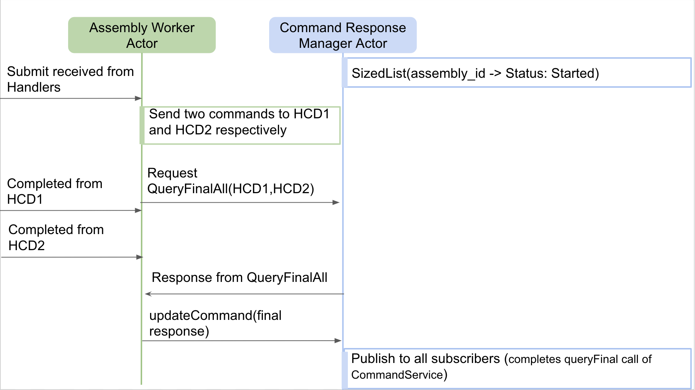

# Command

Commands can be sent to other component and responses can be received in return. To understand the underlying framework 
of the components and its deployment, please refer to the @ref[framework technical doc](../framework/framework.md).

## Sending Commands from the Component

The types of commands that can be sent by a component are discussed @ref[here](../../commons/create-component.md#receiving-commands). In order to send
commands to other components, a [CommandService]($github.base_url$/csw-command/csw-command-api/src/main/scala/csw/command/api/scaladsl/CommandService.scala) helper
is needed. `CommandService` helper is used to send commands to a component in the form of methods instead of sending messages directly to a component's
Supervisor actor. The creation of a CommandService instance can be found @ref[here](../../commons/multiple-components.md#sending-commands).

The operations allowed through `CommandService` helper are as follows:

- [validate]($github.base_url$/csw-command/csw-command-client/src/main/scala/csw/command/client/internal/CommandServiceImpl.scala#L38)
- [submit]($github.base_url$/csw-command/csw-command-client/src/main/scala/csw/command/client/internal/CommandServiceImpl.scala#L46)
- [submitAndWait]($github.base_url$/csw-command/csw-command-client/src/main/scala/csw/command/client/internal/CommandServiceImpl.scala#L49)
- [submitAllAndWait]($github.base_url$/csw-command/csw-command-client/src/main/scala/csw/command/client/internal/CommandServiceImpl.scala#L55)
- [oneway]($github.base_url$/csw-command/csw-command-client/src/main/scala/csw/command/client/internal/CommandServiceImpl.scala#L74)
- [onewayAndMatch]($github.base_url$/csw-command/csw-command-client/src/main/scala/csw/command/client/internal/CommandServiceImpl.scala#L77)
- [query]($github.base_url$/csw-command/csw-command-client/src/main/scala/csw/command/client/internal/CommandServiceImpl.scala#L96)
- [queryFinal]($github.base_url$/csw-command/csw-command-client/src/main/scala/csw/command/client/internal/CommandServiceImpl.scala#L104)
- [subscribeCurrentState]($github.base_url$/csw-command/csw-command-client/src/main/scala/csw/command/client/internal/CommandServiceImpl.scala#L107)
 
## Receiving Responses from Components

### Submit

To understand the flow of the Submit command, please refer to this @ref[section](../../commons/command.md#the-submit-message). 

### Oneway

To understand the flow of Oneway, please refer to this @ref[section](../../commons/command.md#the-oneway-message).
 

### Validate

To understand the flow of the Validate command, please refer to this @ref[section](../../commons/command.md#validate) and the code base for the implementation can be
found [here]($github.base_url$/csw-framework/src/main/scala/csw/framework/internal/component/ComponentBehavior.scala#L154).

### Command Response Manager

Upon receiving a `Submit` command by a component (for example an Assembly receives a Submit command), the component can choose to send one or more
commands to HCD(s) as part of the Submit command's execution. Once, all the response(s) are received from downstream HCD(s), the Assembly needs to complete
the `Submit` as either `Completed` or `Error`. The [CommandResponseManager]($github.base_url$/csw-command/csw-command-client/src/main/scala/csw/command/client/CommandResponseManagerActor.scala)
provides different mechanisms to assist in generating the original `Submit` command's final state.

The Assembly worker can communicate with `CommandResponseManagerActor` using [CommandResponseManager]($github.base_url$csw-command/csw-command-client/src/main/scala/csw/command/client/CommandResponseManager.scala)
coming via [CswContext]($github.base_url$/csw-framework/src/main/scala/csw/framework/models/CswContext.scala#L43).

### Current State Pub/Sub Functionality

The framework provides a way, based only on Akka, for one component to subscribe to `CurrentState` events provided in another component.
This can be used by an HCD to keep an Assembly up to date on its internal state asynchronously outside of commands. This can also be coupled with the use of 
`Oneway` commands that do not provide completion responses to the sender as is done for `Submit`. 
The provider of CurrentState can use [CurrentStatePublisher]($github.base_url$/csw-framework/src/main/scala/csw/framework/models/CswContext.scala#L42)
to publish its state from `CswContext` and the sender component can receive state using [subscribeCurrentState]($github.base_url$/csw-command/csw-command-client/src/main/scala/csw/command/client/internal/CommandServiceImpl.scala#L107)
from `CommandService`.

The Current State Pub/Sub is implemented in [PubSubBehavior]($github.base_url$/csw-framework/src/main/scala/csw/framework/internal/pubsub/PubSubBehavior.scala)