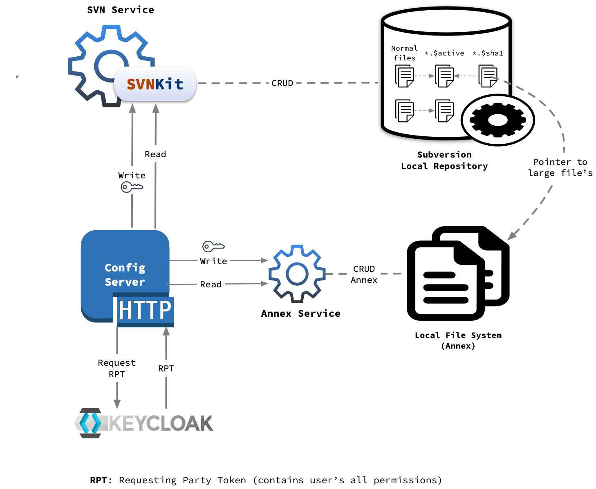
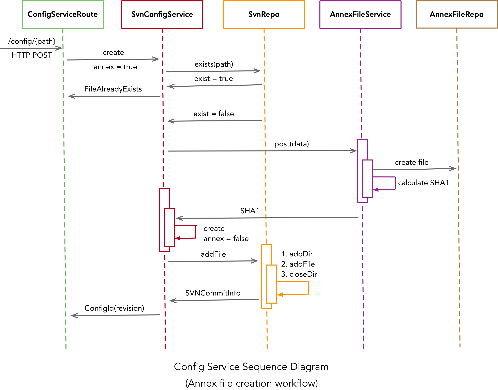

# Configuration Service

## Introduction

The Configuration Service maintains all the configuration files in version control system ([Subversion](https://subversion.apache.org/) repository) which tracks the history of file and directory changes over time.
We access Subversion programmatically using [SVNKit](https://svnkit.com) which is a pure Java Subversion client library.

For information on _using_ the Configuration Service, see these sections:

- @ref:[Configuration Service](../../services/config.md)
- @ref:[Config CLI](../../apps/cswconfigcli.md)

## Architecture

Configuration service is divided into following modules:

1. **Server**
    1. It exposes HTTP rest end points to store/retrieve configuration files from central repository.
    1. Internally server maintains two types of repositories:
        1. SVN Repository: store for normal/small files
        1. Annex File Repository: store for large files

1. **Client**
    1. Config client is a convenient lightweight wrapper for accessing the CSW Configuration HTTP Server.
    1. It is build using Akka Http's [request level](https://doc.akka.io/docs/akka-http/current/client-side/request-level.html) client API.

1. **CLI**
    1. It is a command line application which internally uses Config Client and hides HTTP interaction with Config server.
    1. This CLI also provides additional *login/logout* commands to authenticate and authorize user to perform administrator actions such as *create/update/delete etc.* operations.

## Configuration Server

Configuration server is made up of following three main components:

1. HTTP Routes/Layer
1. SVN Service/Repo
1. Annex Service

### HTTP Routes/Layer

Configuration server exposes set of HTTP routes to write or read configuration files to/from subversion(svn) or local file system(annex).

### Write Routes

- create
- update
- delete
- setActive
- resetActive

These are *admin* protected which uses utilities provided by [csw-aas-http](../aas/csw-aas-http.html) adapter for protection. `csw-aas-http` adapter internally uses [Keycloak](https://www.keycloak.org/) for authentication and authorization.

Admin protected routes expects `Access Token` to have `config-admin` realm role. This token needs to be passed in HTTP requests header field called `Authorization: Bearer ****`.

### Read Routes

- get
- get active
- get metadata
- list
- history

These routes are read only and not protected. Anyone with valid HTTP request can access these routes.

### SVN Service/Repo

Primary store for small or normal configuration files is Subversion. [SVNKit](https://svnkit.com) is used to perform all the read's and write's operations programmatically.

There is a notion of active files in configuration service. Whenever user creates new file using *create* API provided by service, there are following two files gets created in svn behind the scenes.

- Normal file which user has requested with provided content
- `{name}.$active` file which keeps track of current active version of file

Once new file is created, user can keep updating it as and when required but `{name}.$active` file will still point to initial version of file.
When user is done with changes and wants respective components to pick these new changes, he can mark specific version as active version by using `setActiveVersion` API. These will update `{name}.$active` file to point to provided version.

### Annex Service

Large/Binary files are stored in annex repo. There are two ways file gets archived in annex store:

- Files of size more than 10 MB
- If user explicitly specifies `annex=true` while creating new file

Whenever new annex file has to be created, there are following three files gets created in svn and annex store behind the scenes:

- actual large file which user has requested with provided content in annex store
- while creating large file, it's sha gets calculated based on file content and new file `{name}.$sha1` with this sha gets created in svn repo
- `{name}.$active` file which keeps track of current active version of file

## Internals

Important classes involved in configuration service are:

- [ConfigServiceRoute]($github.base_url$/csw-config/csw-config-server/src/main/scala/csw/config/server/http/ConfigServiceRoute.scala): contains all the read and write http routes 

- [SvnConfigService]($github.base_url$/csw-config/csw-config-server/src/main/scala/csw/config/server/svn/SvnConfigService.scala): responsible for all the interactions with SvnRepo and AnnexFileService to perform CRUD operations 

- [SvnRepo]($github.base_url$/csw-config/csw-config-server/src/main/scala/csw/config/server/svn/SvnRepo.scala): responsible for all the CRUD operations on svn repository using [SVNKit](https://svnkit.com)

- [AnnexFileService]($github.base_url$/csw-config/csw-config-server/src/main/scala/csw/config/server/files/AnnexFileService.scala): responsible for calculating SHA1 based on file content and interacting with AnnexFileRepo to perform CRUD operations

- [AnnexFileRepo]($github.base_url$/csw-config/csw-config-server/src/main/scala/csw/config/server/files/AnnexFileRepo.scala): represents file based repository for large/binary/annex files
        
Below sequence diagram indicates how these classes are involved in creation of annex file: 

