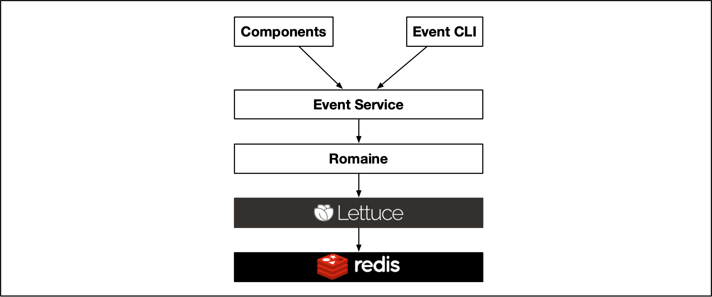
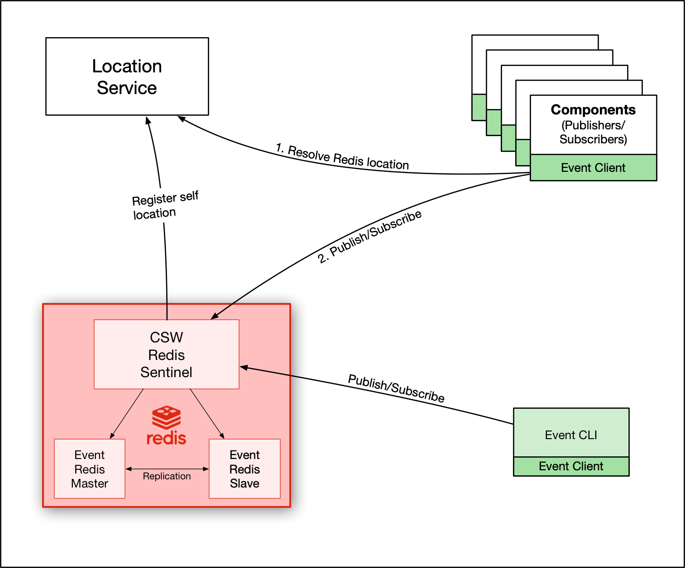

# Event Service

## Introduction

Event Service is a [PubSub](https://en.wikipedia.org/wiki/Publish%E2%80%93subscribe_pattern) Service which allows publishing and subscription of 
@ref:[Events](./../../messages/events.md) based on Event Key which is a combination of Prefix and Event Name. 
Event Service is optimized for the high performance requirements of events as demands with varying rates, for ex. 100 Hz, 50 Hz etc., but
can also be used with events that are published infrequently or when values change.
The end-to-end latency of events assured by Event service is 5 milliseconds. It also ensures ordered delivery of events with no event loss within performance specification. 

In the TMT control system, events may be created as the output of a calculation by one component for the input to a calculation in 
one or more other components. Demand events often consist of events that are published at a specific rate.

## Technology

There were two good candidates for the backend of Event Service - [Apache Kafka](https://kafka.apache.org/) and [Redis](https://redis.io/). 
The Event Service API is implemented with both the backends and a performance testing was done to select one particular backend 
which would cater to our low latency requirements.
Redis seemed to be a good choice for the backend as it turned out to be better at providing low latency 
unlike Kafka which is more suited for high throughput systems.
Hence you can see 2 implementations of the API in the Event Service client. The code is structured in a way that it is easy to switch the implementations.

@scaladoc[EventServiceFactory](csw.event.client.EventServiceFactory) in event-client which provides APIs to make new 
@scaladoc[EventService](csw.event.api.scaladsl.EventService) or @scaladoc[IEventService](csw.event.api.javadsl.IEventService)
takes an @scaladoc[EventStore](csw.event.client.models.EventStore) which could be either @scaladoc[RedisStore](csw.event.client.models.EventStores.RedisStore) or
@scaladoc[KafkaStore](csw.event.client.models.EventStores.KafkaStore). The default value is set to RedisStore.
 
Event Service uses [Redis' PubSub](https://redis.io/topics/pubsub) for publishing and subscribing to events.
And to cater a specific feature of fetching the latest event on subscription, [set operation](https://redis.io/commands/set) of Redis DB is used.

We have created a scala library called "Romaine" to communicate to Redis.

## Event Publishing

Publishing of events involves two things -

* Publish the event in Redis

* Setting the value of event against the event key in redis. This is to cater to a specific requirement of fetching latest event as soon as a new subscription happens.

In case, when Event Server is not available, the Publish APIs would fail with an exception @scaladoc[EventServerNotAvailable](csw.event.api.exceptions.EventServerNotAvailable).
If due to any other reasons, the publishing of events fail, the publish APIs would throw a @scaladoc[PublishFailure](csw.event.api.exceptions.PublishFailure)

## Event Subscription

Subscribing to event keys returns an [Akka Stream](https://doc.akka.io/docs/akka/current/stream/index.html) of events. Subscription to concrete event keys as well as to glob-style patterns is supported.
With pattern subscription, the subscriber receives all the events with event-keys that match the provided pattern. The subscriber gets a handle 0to instance of @scaladoc[EventSubscription](csw.event.api.scaladsl.EventSubscription) which could be used to unsubscribe.  

The subscription API supports subscribing with different modes to control the rate of events you receive. Two modes are provided - RateAdapterMode and RateLimiter mode. Details of when to use which mode could be found @scaladoc[here](csw/event/api/scaladsl/SubscriptionMode).

Subscriber API also provides a `get` API which could be used to fetch the latest events for the specified event keys.

In case, when Event Server is not available, the Subscribe APIs would fail with an exception @scaladoc[EventServiceNotAvailable](csw.event.api.exceptions.EventServiceNotAvailable)

## Architecture

In order to allow components to discover Event Server/Event Store, it is necessary to register it with the Location Service.
Event Server here is referred to the Redis instance(particularly [Redis Sentinel](https://redis.io/topics/sentinel)).

For high availability of event server, we use the Redis Sentinel along with a master and a slave. Master and slave are configured in "replication" mode.

The Sentinel's responsibility is to promote the slave as master when master goes down. It is important to note that when master
goes down, the "location" of Event Server remains the same because the location of Event Server is the location of Sentinel and not of master or slave.
The master and slave Redis instances are dedicated for event, however Sentinel is shared across CSW Redis-based services. 
As Sentinel caters to more than one master, we need to specify which master to connect to for event server.
That is configured in `reference.conf` in `csw-event-client` project. 

@@snip [reference.conf](../../../../../csw-event/csw-event-client/src/main/resources/reference.conf) { #master-configuration }
 

Once location is registered, components and event CLI can resolve Event server location and start publishing/subscribing. 

