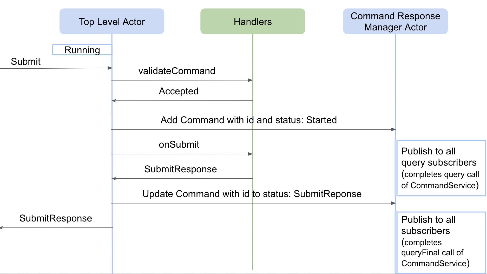
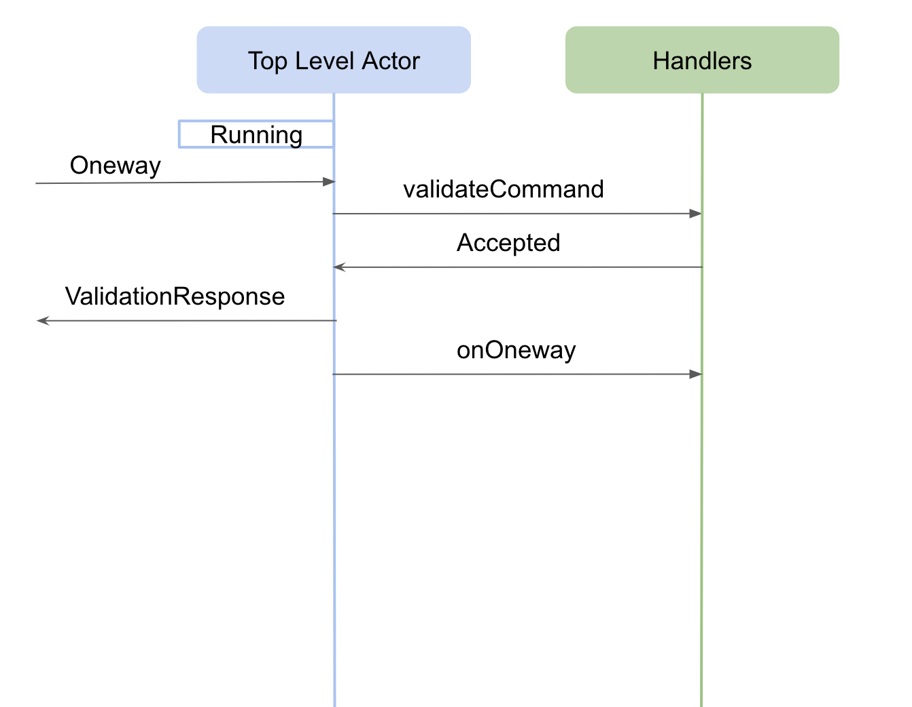

# Framework

## Introduction

The common software framework is a library that provides set of APIs used for:

- creation of components(Assemblies, HCDs) 
- discovering other components
- receiving messages from external world
- sending messages/commands to other components
- receiving responses from components
- deploying component in container or standalone mode 

The CSW framework is implemented using [Akka typed actors](https://doc.akka.io/docs/akka/current/typed/index.html).

@@@ note {title="IMPORTANT!!!"}

Actors provide a single control of execution by processing messages received one by one, but it is still necessary to be careful
with actor state. If a Future is spawned inside an actor then on
completion of that Future, it is a common mistake to mutate actor state. It can cause critical problems of state corruption because some other message
might be in the process of execution and accessing the actor state. The ideal way to handle Futures inside actors is by sending message to self on Future
completion. This will make sure the mutation of state happens in order of one by one via messages. Example code can be seen 
@github[here](/csw-framework/src/main/scala/csw/framework/internal/supervisor/SupervisorBehavior.scala#L279).

@@@
  
## Creation of A Component

A component consists of couple of actors and classes created by framework on behalf of the component and some actors/classes that are expected to
be created by component writers using the CSW framework.

### Framework Actors/Classes

During component creation the CSW framework creates a @github[Supervisor](/csw-framework/src/main/scala/csw/framework/internal/supervisor/SupervisorBehavior.scala) actor as the
first thing when creating any component. Each component has its own Supervisor. That Supervisor then goes on to create the 
@github[Top Level Actor](/csw-framework/src/main/scala/csw/framework/internal/component/ComponentBehavior.scala) using the component's unique `Handlers`,
@github[Pub-Sub Manager](/csw-framework/src/main/scala/csw/framework/internal/pubsub/PubSubBehavior.scala) actor and 
@github[Command Response Manager](/csw-command/csw-command-client/src/main/scala/csw/command/client/CommandResponseManagerActor.scala) actor as part of
the TMT framework supporting a component.

@@@ note

- The actors shown in blue are created by CSW framework and actors/classes shown in green are expected to be written by the component developer. 
- The `Handlers` shown above is implemented by extending @github[ComponentHandlers](/csw-framework/src/main/scala/csw/framework/scaladsl/ComponentHandlers.scala)/
@github[JComponentHandlers](/csw-framework/src/main/scala/csw/framework/javadsl/JComponentHandlers.scala) framework class. So, the TLA decides when to call a
specific handler method or `hooks` and implementation of `ComponentHandlers/JComponentHandlers` decides what to do when it is called, for e.g. TLA
decides when to call @github[intialize](/examples/src/main/scala/org/tmt/nfiraos/sampleassembly/SampleAssemblyHandlers.scala#L128) handler and handler
provides implementation of how to initialize a component, may be by putting the hardware in default position, etc.
- From the framework's viewpoint, the TLA is created with an instance of 
@github[ComponentBehavior](/csw-framework/src/main/scala/csw/framework/internal/component/ComponentBehavior) and the `Handlers` created by the developer.
The ComponentBehavior actor has the framework behavior such as lifecycle.  It manages incoming messages and calls the `Handlers` when appropriate.   

@@@

To know more about the responsibility of Supervisor and Top Level Actor please refer this @ref:[section](../../commons/create-component.md#anatomy-of-component).

The interaction between supervisor and Top Level Actor when creating the component is shown below:

 

The code base that implements the creation of Top Level Actor and watching it from its Supervisor can be found @github[here](/csw-framework/src/main/scala/csw/framework/internal/supervisor/SupervisorBehavior.scala#L301).
The code that implements the startup lifecycle and the calling of the `intialize` handler of Top Level Actor can be found @github[here](/csw-framework/src/main/scala/csw/framework/internal/component/ComponentBehavior.scala#L84).
An explanation of the `Idle` state can be found @ref[here](../../commons/create-component.md#idle). 
 
@@@ note

If there is any exception thrown while executing `initialize` handler then the exception is bubbled up to Supervisor, and it restarts Top Level
Actor which in turn calls `initialize` handler again hoping the error fixes on restart. For this, Supervisor uses a restart strategy with maximum of 3
restarts possible that must be finished within 5 seconds. To know more about the Akka supervision failure strategy please refer to the [Akka Fault Tolerance](https://doc.akka.io/docs/akka/current/typed/fault-tolerance.html)
document. The Supervisor code base wiring restart strategy can be found @github[here](/csw-framework/src/main/scala/csw/framework/internal/supervisor/SupervisorBehavior.scala#L309). 

@@@

Once the handler is spawned it receives an `ActorContext` and @github[CswContext](/csw-framework/src/main/scala/csw/framework/models/CswContext.scala) in its
constructor. The `ActorContext` is used to get the `ActorSystem` of the component and maybe spawn other actors i.e worker actors for maintaining state.
The `CswContext` can be used to get the handle of all the services provided by CSW. To know more about these services please refer to this
@ref[section](../../commons/create-component.md#csw-services-injection).

### Component Info File for Component Startup

Every component needs to provide a startup config file called the Component Info File that contains component details such as name, type, handler class name, tracking details, etc.
The contents of this file is used by Supervisor to create and setup the component as well as some customization.
To know more about what is it and how to write the Component Info File please refer this @ref[section](../../framework/describing-components.md) and 
a @ref[sample file](../../commons/multiple-components.md#component-configuration-componentinfo). 

The name of the Component Info File needs to be passed to @ref[Container/Standalone app](../../framework/deploying-components.md) at the time of startup.
The file is either fetched from `Configuration Service` or taken from local path on the machine to parse to a @github[ComponentInfo](/csw-command/csw-command-client/src/main/scala/csw/command/client/models/framework/ComponentInfo.scala)
object. The `ComponentInfo` object is then passed to `Handlers` in `CswContext`.

A component may be created in @ref:[standalone or container](../../commons/multiple-components.md) mode. In standlone mode, the component
is created in its own JVM process. In container mode, multiple components may be started together within the same JVM process. 
When an HCD or Assembly is @ref:[created](../../framework/creating-components.md), depending on the mode,
either the @github[ContainerBehaviorFactory](/csw-framework/src/main/scala/csw/framework/internal/container/ContainerBehaviorFactory.scala) or the 
@github[SupervisorBehaviorFactory](/csw-framework/src/main/scala/csw/framework/internal/supervisor/SupervisorBehaviorFactory.scala) class is used to
create the initial TLA behavior. 

In container mode, a Supervisor actor is created for each component and a single @github[container actor](/csw-framework/src/main/scala/csw/framework/internal/container/ContainerBehavior.scala)
accepts control messages for the container (subtypes of `ContainerActorMessage`). These container messages can be used to manage the lifecycle of the
components in the container. 

### ActorSystem for the Component

While creating a component a new ActorSystem is spawned, which means if there are more than one components running in single JVM process there will
be more than one ActorSystem created in the single JVM. Having different ActorSystems in an application is not recommended by [akka](https://doc.akka.io/docs/akka/current/general/actor-systems.html)
but it is still kept multiple per JVM so that any delay in executing in one component does not affect the execution of other components running in the same
JVM. The code base for creating an ActorSystem for each component is written in @github[SupervisorInfoFactory](/csw-framework/src/main/scala/csw/framework/internal/supervisor/SupervisorInfoFactory.scala#L35).

## Discovering Other Components

Sometimes one component needs to discover other components. For discovering other components, there are two ways:

 - provide tracking information in the Component Info File as explained @ref[here](../../commons/multiple-components.md#tracking-dependencies). Whenever
 there is location update of tracked components @ref[onLocationTrackingEvent](../../commons/multiple-components.md#onlocationtrackingevent-handler) handler
 is called in the TLA. 

- track using @ref[trackConnection](../../commons/multiple-components.md#trackconnection) method that is available in the TLA. This allows tracking to start
at runtime based on activities of the component.

## Receiving Messages from Outside the Component

Messages sent to the component are first received and handled by Supervisor. It decides which messages should be passed to downstream actors (i.e. Top Level Actor, 
Command Response Manager actor or Pub-Sub Manager actor).

### Restart

An external administrative message to the Supervisor can cause the component to restart.
An explanation of the `Restart` state and subsequent actions can be found @ref[here](../../commons/create-component.md#restart).
The code base that implements restart can be found @github[here](/csw-framework/src/main/scala/csw/framework/internal/supervisor/SupervisorBehavior.scala#L242).

### Shutdown

An external administrative command to the Supervisor can cause the component to shutdown and exit.
The explanation about `Shutdown` state and subsequent actions can be found @ref[here](../../commons/create-component.md#shutdown).
The code base that implements shutdown can be found @github[here](/csw-framework/src/main/scala/csw/framework/internal/supervisor/SupervisorBehavior.scala#L247).

### Changing log level

An external messages to change the component's log level (via `SetComponentLogLevel`) or get log metadata for a component (via `GetComponentLogMetadata`) gets handled by Supervisor.
The code base implements this message can be found @github[here](/csw-framework/src/main/scala/csw/framework/internal/supervisor/SupervisorBehavior.scala#L118). 

### Lock

An external client component can restrict messages and allow only messages from itself using the `lock` command. 
An explanation of the `Lock` state can be found @ref[here](../../commons/create-component.md#lock). 
The code base that implements Lock can be found @github[here](/csw-framework/src/main/scala/csw/framework/internal/supervisor/SupervisorBehavior.scala#L205).

## Sending Commands from the Component

The types of commands that can be sent by a component are discussed @ref[here](../../commons/create-component.md#receiving-commands). In order to send
commands to other components, a @github[CommandService](/csw-command/csw-command-api/src/main/scala/csw/command/api/scaladsl/CommandService.scala) helper
is needed. `CommandService` helper is used to send commands to a component in the form of methods instead of sending messages directly to a component's
Supervisor actor. The creation of a CommandService instance can be found @ref[here](../../commons/multiple-components.md#sending-commands).

The operations allowed through `CommandService` helper are as follows:

- @github[validate](/csw-command/csw-command-client/src/main/scala/csw/command/client/internal/CommandServiceImpl.scala#L38)
- @github[submit](/csw-command/csw-command-client/src/main/scala/csw/command/client/internal/CommandServiceImpl.scala#L46)
- @github[submitAndWait](/csw-command/csw-command-client/src/main/scala/csw/command/client/internal/CommandServiceImpl.scala#L49)
- @github[submitAllAndWait](/csw-command/csw-command-client/src/main/scala/csw/command/client/internal/CommandServiceImpl.scala#L55)
- @github[oneway](/csw-command/csw-command-client/src/main/scala/csw/command/client/internal/CommandServiceImpl.scala#L74)
- @github[onewayAndMatch](/csw-command/csw-command-client/src/main/scala/csw/command/client/internal/CommandServiceImpl.scala#L77)
- @github[query](/csw-command/csw-command-client/src/main/scala/csw/command/client/internal/CommandServiceImpl.scala#L96)
- @github[queryFinal](/csw-command/csw-command-client/src/main/scala/csw/command/client/internal/CommandServiceImpl.scala#L104)
- @github[subscribeCurrentState](/csw-command/csw-command-client/src/main/scala/csw/command/client/internal/CommandServiceImpl.scala#L107)
 
## Receiving Responses from Components

### Submit

To understand the flow of the Submit command please refer to this @ref[section](../../commons/command.md#the-submit-message). 

### Oneway

To understand the flow of Oneway please refer to this @ref[section](../../commons/command.md#the-oneway-message).
 

### Validate

To understand the flow of the Validate command please refer to this @ref[section](../../commons/command.md#the-validate-message) and the code base for the implementation can be
found @github[here](/csw-framework/src/main/scala/csw/framework/internal/component/ComponentBehavior.scala#L154).

### Command Response Manager

Upon receiving a `Submit` command by a component (for example an Assembly receives a Submit command), the component can choose to send one or more
commands to HCD(s) as part of the Submit command's execution. Once, all the response(s) are received from downstream HCD(s), the Assembly needs to complete
the `Submit` as either `Completed` or `Error`. The @github[CommandResponseManager](/csw-command/csw-command-client/src/main/scala/csw/command/client/CommandResponseManagerActor.scala)
provides different mechanisms to assist in generating the original `Submit` command's final state.

The Assembly worker can communicate with `CommandResponseManagerActor` using @github[CommandResponseManager](csw-command/csw-command-client/src/main/scala/csw/command/client/CommandResponseManager.scala)
coming via @github[CswContext](/csw-framework/src/main/scala/csw/framework/models/CswContext.scala#L43).

### Current State Pub/Sub Functionality

The framework provides a way, based only on Akka, for one component to subscribe to `CurrentState` events provided in another component.
This can be used by an HCD to keep an Assembly up to date on its internal state asynchronously outside of commands. This can also be coupled with the use of 
`Oneway` commands that do not provide completion responses to the sender as is done for `Submit`. 
The provider of CurrentState can use @github[CurrentStatePublisher](/csw-framework/src/main/scala/csw/framework/models/CswContext.scala#L42)
to publish its state from `CswContext` and the sender component can receive state using @github[subscribeCurrentState](/csw-command/csw-command-client/src/main/scala/csw/command/client/internal/CommandServiceImpl.scala#L107)
from `CommandService`.

The Current State Pub/Sub is implemented in @github[PubSubBehavior](/csw-framework/src/main/scala/csw/framework/internal/pubsub/PubSubBehavior.scala)

## Deploying Component in Container or Standalone Mode

Component(s) can start within a @ref[container](../../framework/deploying-components.md#container-for-deployment) or a single component can start as a
@ref[standalone](../../framework/deploying-components.md#standalone-components). The code implementing deployment for Container is @github[here](/csw-framework/src/main/scala/csw/framework/internal/container/ContainerBehavior.scala) 
and for Standalone @github[here](/csw-framework/src/main/scala/csw/framework/internal/wiring/Standalone.scala). 

The name of the Component Information File can be passed as a command line argument to an application using the 
@github[ContainerCmd](/csw-framework/src/main/scala/csw/framework/deploy/containercmd/ContainerCmd.scala)
class to @ref:[deploy](../../framework/deploying-components.md) the component.

In a production environment, it is planned that components will be started at boot time using a @ref:[HostConfig](../../apps/hostconfig.md) based
application.

Since Akka Typed is used throughout the TMT framework, there are seperate messages understood by Container, Supervisor, Top level Actor and other actors
of the CSW framework. The architecture/relations of and between messages can be found @github[here](/csw-command/csw-command-client/src/main/scala/csw/command/client/messages/MessagesArchitecture.scala). 

