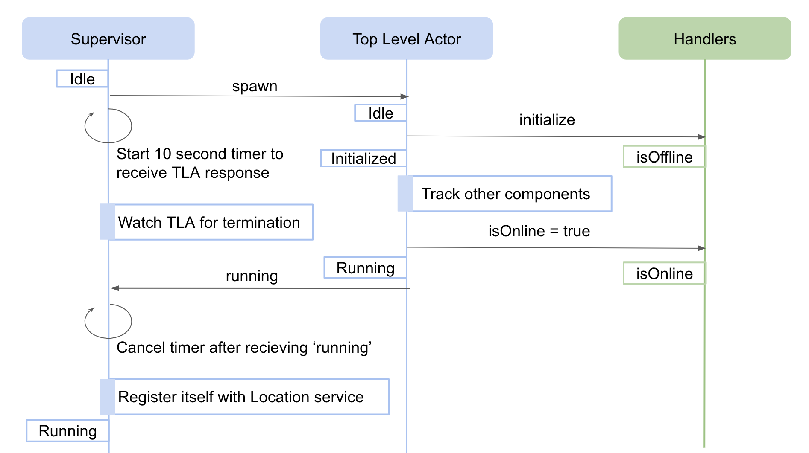
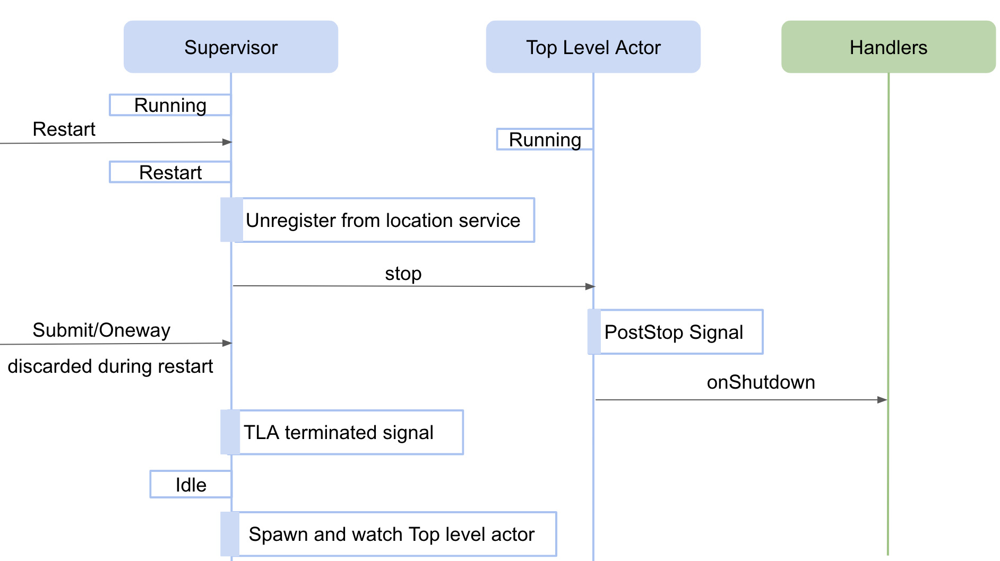
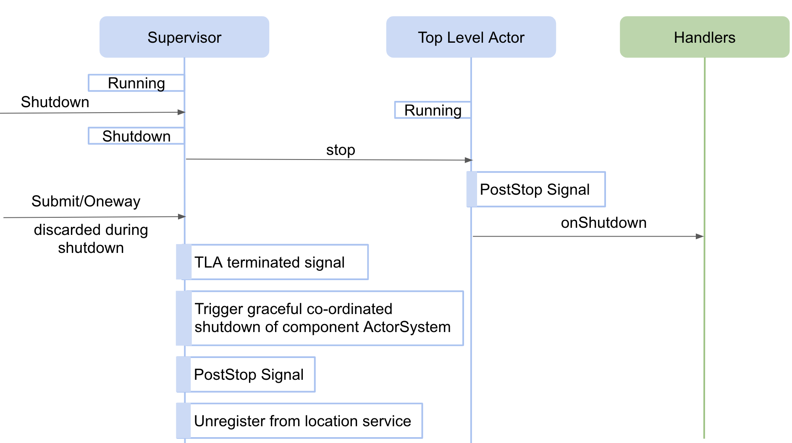
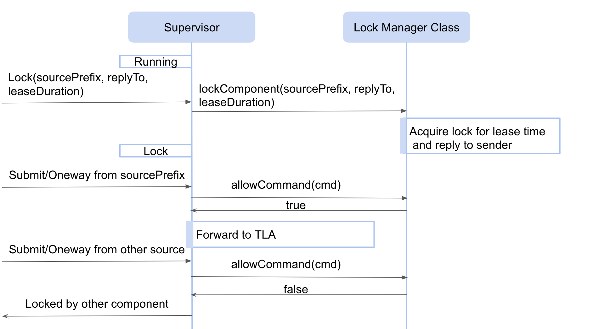

# Framework

## Introduction

The common software framework is a library that provides set of APIs used for:

- creation of components(Assemblies, HCDs) 
- discovering other components
- receiving messages from external world
- sending messages/commands to other components
- receiving responses from components
- publishing and subscribing state
- deploying component in container or standalone mode 

The CSW framework is implemented using [Akka typed actors](https://doc.akka.io/docs/akka/current/typed/index.html).

@@@ note {title="IMPORTANT!!!"}

Actors provide a single control of execution by processing messages received one by one. If a future is spawned inside an actor then on
completion of that future, it is a common mistake to mutate actor state. It causes critical problems of state corruption because some other message
might be in process of execution and accessing the state. The ideal way to handle futures inside actors is by sending message to self on future
completion. This will make sure the mutation of state happens in order of one by one via messages. The example code can be seen 
@github[here](/csw-framework/src/main/scala/csw/framework/internal/supervisor/SupervisorBehavior.scala#L279).

@@@
  
  
## Creation of component

A component consists of couple of actors and classes created by framework on behalf of the component and some actors/classes that are expected to
be created by component writers using the csw framework.

### Framework actors/classes

The csw framework creates a @github[Supervisor](/csw-framework/src/main/scala/csw/framework/internal/supervisor/SupervisorBehavior.scala) actor as the
first thing while creating any component. The Supervisor goes on to create @github[Top Level Actor](/csw-framework/src/main/scala/csw/framework/internal/component/ComponentBehavior.scala),
@github[Pub-Sub Manager](/csw-framework/src/main/scala/csw/framework/internal/pubsub/PubSubBehavior.scala) actor and 
@github[Command Response Manager](/csw-command/csw-command-client/src/main/scala/csw/command/client/CommandResponseManagerActor.scala) actor as part of
TMT framework.

@@@ note

- The actors shown in blue are created by framework and actors/classes shown in green is expected to be written by component developer. 
- The `Handlers` shown above is implemented by extending @github[ComponentHandlers](/csw-framework/src/main/scala/csw/framework/scaladsl/ComponentHandlers.scala)/
@github[JComponentHandlers](/csw-framework/src/main/scala/csw/framework/javadsl/JComponentHandlers.scala) framework class. So, the TLA decides when to call a
specific handler method or `hooks` and implementation of `ComponentHandlers/JComponentHandlers` decides what to do when it is called, for e.g. TLA
decides when to call @github[intialize](/examples/src/main/scala/org/tmt/nfiraos/sampleassembly/SampleAssemblyHandlers.scala#L128) handler and handler
provides implementation of how to initialize a component, may be by putting the hardware in default position, etc.

@@@

To know more about the responsibility of Supervisor and Top level actor please refer this @ref:[section](../../commons/create-component.md#anatomy-of-component).

The interaction between supervisor and top level actor for creating component is shown below:

 

The code base for creation of Top level actor and watching it, from Supervisor can be found @github[here](/csw-framework/src/main/scala/csw/framework/internal/supervisor/SupervisorBehavior.scala#L301)
and code base for calling `intialize` handler from top level actor can be found @github[here](/csw-framework/src/main/scala/csw/framework/internal/component/ComponentBehavior.scala#L84).
The explanation about `Idle` state can be found @ref[here](../../commons/create-component.md#idle). 
 
@@@ note

If there is any exception thrown while executing `initialize` handler then the exception is bubbled up till Supervisor and it restarts Top level
actor which in turn calls `initialize` handler again hoping the error fixes on restart. For this, Supervisor uses restart strategy with maximum of 3
restarts possible and to be done within 5 seconds. To know more about akka supervision failure strategy please refer [Akka Fault Tolerance](https://doc.akka.io/docs/akka/current/typed/fault-tolerance.html)
document. The Supervisor code base wiring restart strategy can be found @github[here](/csw-framework/src/main/scala/csw/framework/internal/supervisor/SupervisorBehavior.scala#L309). 

@@@

Once the handler is spawned it receives `ActorContext` and @github[CswContext](/csw-framework/src/main/scala/csw/framework/models/CswContext.scala) in it's
constructor. The `ActorContext` is used to get the `ActorSystem` of the component and maybe spawn other actors i.e worker actors for maintaining state.
The `CswContext` can be used to get the handle of all the services provided by CSW. To know more about these services please refer this
@ref[section](../../commons/create-component.md#csw-services-injection).

### Configuration file for component startup

Every component needs to provide a startup config file that contains the details like name, type, handler class name, tracking details, etc.
To know more about what is it and how to write the config file please refer this @ref[section](../../framework/describing-components.md) and 
a @ref[sample file](../../commons/multiple-components.md#component-configuration-componentinfo). 

The name of the configuration file needs to be passed to @ref[Container/Standalone app](../../framework/deploying-components.md) at the time of startup.
The config file is either fetched from `Configuration Service` or taken from local path on the machine to parse it to a @github[ComponentInfo](/csw-command/csw-command-client/src/main/scala/csw/command/client/models/framework/ComponentInfo.scala)
object. The `ComponentInfo` object is then passed to `Handlers` in `CswContext`.

### ActorSystem for component

While creating a component, a new ActorSystem is spawned, which means if there are more than one components running in single jvm process there will
be more than one ActorSystems created in single jvm. Having different ActorSystems in an application is not recommended by [akka](https://doc.akka.io/docs/akka/current/general/actor-systems.html)
but it is still kept multiple per jvm so that any delay in executing a component does not affect execution of other components running in same
jvm. The code base for creating an ActorSystem for each component is written in @github[SupervisorInfoFactory](/csw-framework/src/main/scala/csw/framework/internal/supervisor/SupervisorInfoFactory.scala#L35).

## Discovering other components

For discovering other components, there are two ways:

 - provide tracking information in configuration file as explained @ref[here](../../commons/multiple-components.md#tracking-dependencies). Whenever
 there is location update of tracked components @ref[onLocationTrackingEvent](../../commons/multiple-components.md#onlocationtrackingevent-handler) handler
 is called. 

- track using @ref[trackConnection](../../commons/multiple-components.md#trackconnection) handler. 

## Receiving messages from external world

Messages aimed for component is first received by Supervisor and it decides which messages to be passed to downstream actors( i.e. Top level actor, 
Command Response manager actor or Pub-Sub manager actor)

### Restart

The code base for restart can be found @github[here](/csw-framework/src/main/scala/csw/framework/internal/supervisor/SupervisorBehavior.scala#L242).
The explanation about `Restart` state can be found @ref[here](../../commons/create-component.md#restart).

### Shutdown

The code base for shutdown can be found @github[here](/csw-framework/src/main/scala/csw/framework/internal/supervisor/SupervisorBehavior.scala#L247).
The explanation about `Shutdown` state can be found @ref[here](../../commons/create-component.md#shutdown).

### Changing log level

Messages to change log level (via `SetComponentLogLevel`) or get log metadata for a component (via `GetComponentLogMetadata`) gets handled by Supervisor.
the code base for the same can be found @github[here](/csw-framework/src/main/scala/csw/framework/internal/supervisor/SupervisorBehavior.scala#L118). 

### Lock

The code base for Lock can be found @github[here](/csw-framework/src/main/scala/csw/framework/internal/supervisor/SupervisorBehavior.scala#L205).
The explanation about `Lock` state can be found @ref[here](../../commons/create-component.md#lock).

## Sending commands

### 
The *CSW Framework* provides the APIs used to talk to components,
such as HCDs and assemblies.
The framework, which is based on Akka [typed actors](https://doc.akka.io/docs/akka/current/typed/index.html), creates an actor for each component, along with a 
@github[supervisor](/csw-framework/src/main/scala/csw/framework/internal/supervisor/SupervisorBehavior.scala) 
and some related actors. 
For simplicity, component developers only need to implement a set of 
@ref:[handlers](../../framework/handling-lifecycle.md) 
(the
@github[ComponentHandlers](/csw-framework/src/main/scala/csw/framework/scaladsl/ComponentHandlers.scala) 
trait for Scala, the
@github[JComponentHandlers](/csw-framework/src/main/scala/csw/framework/javadsl/JComponentHandlers.scala)
interface for Java) which define how a component will behave.

See @ref:[here](../../commons/framework.md) for information on *using* the CSW framework to develop HCD and assembly components.

The @scaladoc[framework packge documentation](csw.framework/index) also contains an overview 
of the core classes that make up the CSW framework.

## Entry Points

In order to start an assembly or HCD component, you first need a 
@ref:[descriptor file](../../framework/describing-components.md)
(or object) called
@github[ComponentInfo](/csw-command/csw-command-client/src/main/scala/csw/command/client/models/framework/ComponentInfo.scala).

The name of the component info file can be passed as a command line argument to an application based on the 
@github[ContainerCmd](/csw-framework/src/main/scala/csw/framework/deploy/containercmd/ContainerCmd.scala)
class to
@ref:[deploy](../../framework/deploying-components.md)
the component.

In a production environment, it is planned that components will be started at boot time using a @ref:[HostConfig](../../apps/hostconfig.md) based application. 

## Component Creation

Components can be created in 
@ref:[standalone or container](../../commons/multiple-components.md) mode. 
When an HCD or assembly is
@ref:[created](../../framework/creating-components.md), depending on the mode,
either the
@github[ContainerBehaviorFactory](/csw-framework/src/main/scala/csw/framework/internal/container/ContainerBehaviorFactory.scala) or the 
@github[SupervisorBehaviorFactory](/csw-framework/src/main/scala/csw/framework/internal/supervisor/SupervisorBehaviorFactory.scala)
class is used to create the initial actor behavior. 
In container mode, a supervisor actor is created for each component and a single
@github[container actor](/csw-framework/src/main/scala/csw/framework/internal/container/ContainerBehavior.scala) 
accepts control messages for the container (subtypes of `ContainerActorMessage`).

Each supervisor then creates and watches its component and determines what to do when something goes wrong. 
It uses an instance of
@github[ComponentBehaviorFactory](/csw-framework/src/main/scala/csw/framework/scaladsl/ComponentBehaviorFactory.scala) 
that is created via reflection from an entry in the
 @ref:[component info file](../../framework/describing-components.md)
 file to create the component.

The top level actor (TLA) representing the 
@github[component's behavior](/csw-framework/src/main/scala/csw/framework/internal/component/ComponentBehavior.scala) uses the instance of 
@github[ComponentHandlers](/csw-framework/src/main/scala/csw/framework/scaladsl/ComponentHandlers.scala)
returned from the supplied ComponentBehaviorFactory to handle incoming messages and commands for the component.

## Component Initialization and Lifecycle

The framework manages a component's 
@ref:[lifecycle](../../framework/handling-lifecycle.md) 
so that it only receives 
@ref:[commands](../../messages/commands.md) 
once it has signaled that it has completed the initialization process.
This includes 
@ref:[tracking any connections](../../framework/tracking-connections.md) 
listed in the component info file.
Once the component is in the running state, it can be discovered using the
@ref:[Location Service](../location/location.md) and other components can start
sending 
@ref[command messages](../../commons/messages.md) 
to it.

## Command Service Clients

Although components are actually actors, it is convenient to be able to treat them as objects and call methods on them. The
@github[CommandService](/csw-command/csw-command-api/src/main/scala/csw/command/api/scaladsl/CommandService.scala) 
trait, and its implementation: 
@github[CommandServiceImpl](/csw-command/csw-command-client/src/main/scala/csw/command/client/internal/CommandServiceImpl.scala)
provide a wrapper that uses Akka `ask` to send a message to a component and return a `Future` with it's response.
The 
@github[CommandServiceFactory](/csw-command/csw-command-client/src/main/scala/csw/command/client/CommandServiceFactory.scala) class can be used to make a `CommandService` instance from a `location` received from the 
@ref:[Location Service](../location/location.md).

## Command Response Handling

A @ref:[Command Response Manager](../../framework/managing-command-state.md) class
is used to manage the responses to a commands sent to a component.
