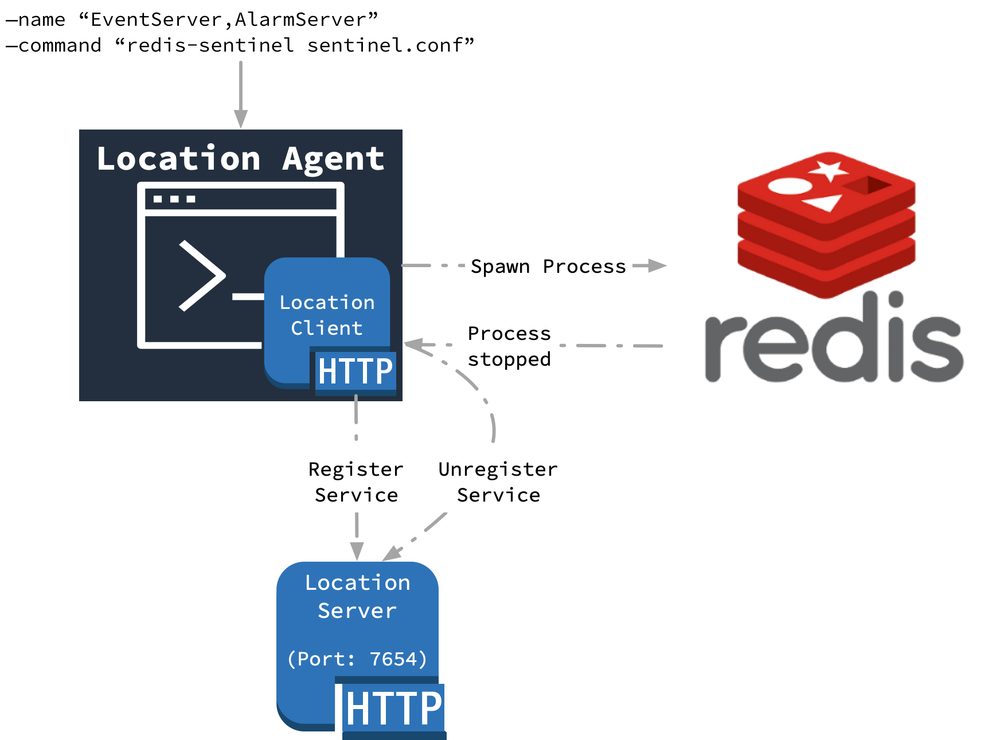

# Location Agent

## Introduction

The [csw-location-agent]($github.dir.base_url$/csw-location/csw-location-agent) project provides an application used to register and track non-csw services, such as Redis, which is used to implement the Event and Alarm Services.

## Usage

See @ref:[here](../../apps/cswlocationagent.md) for the command line usage.

## Design

Location service agent is a CLI application build using @ref[Location Client](./location-client.md).

As shown in above diagram, it accepts external command, name of the services and some other optional arguments.

On execution, Location agent performs following actions in sequence:

1. Spawns new process and executes provided command in that process

1. Adds exit hook on this process, so that agent shutdowns gracefully on termination of child process

1. Registers `Tcp` or `Http` connections with provided component names with location service using location http client

1. Adds shutdown hook to unregister services on termination (this is done as a part of step 2)

Log messages are configured in [application.conf]($github.base_url$/csw-location/csw-location-agent/src/main/resources/application.conf) to log only to file (under `$TMT_LOG_HOME/csw/logs`).
