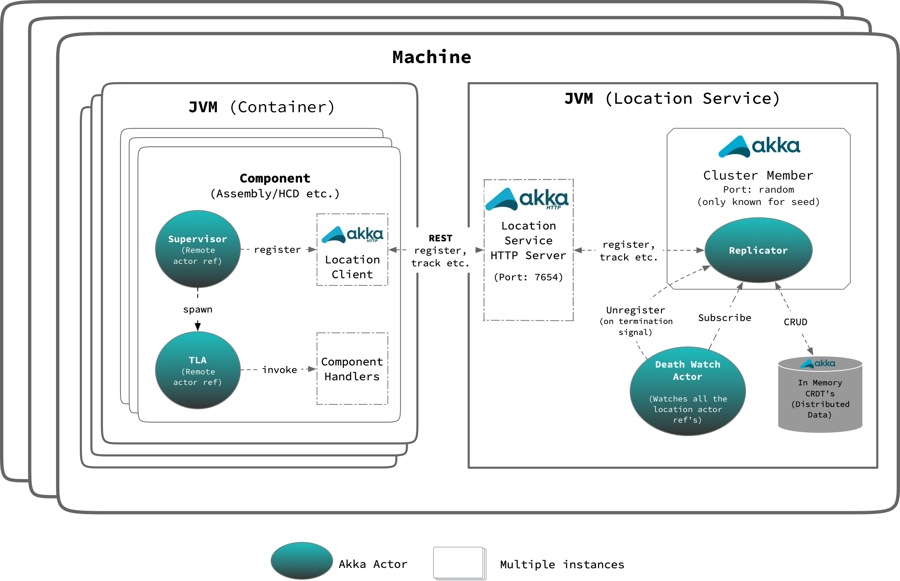
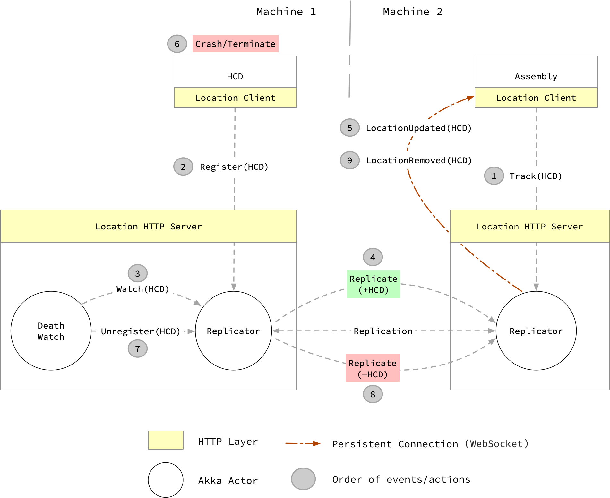

# Location Server

## Introduction

The @github[csw-location-server](/csw-location/csw-location-server) project contains the main implementation of the Location Service.
Think of it as a agent which is running on every machine.
Normally one instance of the _location server_ will run on each host that is running CSW services (although clients can be configured to use a remote host).

## Design

Main building blocks of location service are captured below, we will go through each one of them in following sections:

- [Akka Cluster](https://doc.akka.io/docs/akka/current/index-cluster.html)
- [Conflict Free Replicated Data Types (CRDTs)](https://doc.akka.io/docs/akka/current/typed/distributed-data.html): Shares location information within the network.
- [Akka Http](https://doc.akka.io/docs/akka-http/current)
- DeathWatch Actor

Above diagram shows different parts of location service and how it will look like in TMT environment.
On a single physical machine, we can have multiple JVM's (Java Virtual Machines) running. Roughly these JVM's can be categorized into two types:

- `Container`: It can have single or multiple components (HCD, Assembly etc.) running inside it.
- `Location Service`: Think of it as a agent which is running on all the machines in TMT environment.

@@@ note
Here onwards, we will refer location service as agent or server interchangeably. Do not confuse it with @ref:[csw-location-agent](./location-agent.md).
@@@

Let's discuss different components of `Location Server` in following sections:

### Cluster Member

Location service JVM (precisely Actor System) takes part in [Akka Cluster](https://doc.akka.io/docs/akka/current/index-cluster.html).
By default, this actor system binds to port `3552`. Initially when there is no member in Akka cluster, node joins itself.
Such a node is referred as seed node (introducer) and location of this node needs to be known so that other nodes can join to this known address and form a larger cluster.
After the joining process is complete, seed nodes are not special and they participate in the cluster in exactly the same way as other nodes.

Akka Cluster provides cluster [membership](https://doc.akka.io/docs/akka/current/common/cluster.html#membership) service using [gossip](https://doc.akka.io/docs/akka/current/common/cluster.html#gossip) protocols and an automatic [failure detector](https://doc.akka.io/docs/akka/current/common/cluster.html#failure-detector).

Death watch uses the cluster failure detector for nodes in the cluster, i.e. it detects network failures and JVM crashes, in addition to graceful termination of watched actor.
Death watch generates the `Terminated` message to the watching actor when the unreachable cluster node has been downed and removed. Hence we have kept `auto-down-unreachable-after = 10s` so that in case of failure, interested parties get the death watch notification for the location in around 10s.

### Distributed Data (Replicator)

We use Akka Distributed Data to share CSW components locations between nodes in an Akka Cluster. These locations are accessed with an actor called as `replicator` providing a key-value store like API.
We store following data in this key-value store (distributed data):

- `AllServices`:
  This uses [LWWMap](https://doc.akka.io/docs/akka/current/distributed-data.html?language=scala#maps) CRDT from `Connection` to `Location`. `Connection` and `Location` can be one of `Akka`, `Tcp` or `HTTP` type.
  At any point in time, value of this map represents all the locations registered with `Location Service` in a TMT environment.

- `Service`:
  This uses [LWWRegister](https://doc.akka.io/docs/akka/current/distributed-data.html?language=scala#flags-and-registers) which holds location of CSW component against unique connection name.

#### Consistency Guarantees

- `WriteMajority`: All the write API's (register, unregister etc.) updates registry (distributed data) with consistency level of `WriteMajority` which means value will immediately be written to a majority of replicas, i.e. at least N/2 + 1 replicas, where N is the number of nodes in the cluster
- `ReadLocal`: All the get API's (find, resolve, list etc.): retrieves value from registry (distributed data) with consistency level of `ReadLocal` which means value will only be read from the local replica

In TMT environment, we do not want two components to be registered with same connection name.
This is achieved by configuring consistency level of `WriteMajority` for `register` API.
Register API guarantees that component is register with location service and it's entry is replicated to at least N/2 + 1 replicas.

Based on above configuration, it is always guaranteed that only one location of component will exist at any point in time in registry.
Hence it is safe to read location just from local replica with consistency level of `ReadLocal` with the assumption that eventually location will get replicated on this replica if not present when queried.

### Death Watch Actor

Death watch actor register interest in change notifications for `AllServices` key. Hence on every addition or removal of location, death watch actor receives `Changed[LWWMap[Connection, Location]]` message from where it gets all the current locations.

Death watch actor then starts watching all the new locations. When it receives `Terminated` signal for any of the watched location precisely for actor ref, then it unregister that particular connection from location service.

@@@ note
Death watch actor only supports akka locations and filters out `tcp` and `http` locations.
@@@

### HTTP Server

Location service provides HTTP routes to get, register, unregister and track locations. Only one instance of location server is started on port `7654` on evey machine.
Client from same machine running in different processes can connect to `localhost:7654` to access location service. In most of the cases, you will not directly talk to this address. You will always use loocation service client provided by CSW which internally connects to `localhost:7654` to access `Location Service`.

### How location tracking works

Below diagram illustrate `Assembly` tracking `HCD`. Use case shown in diagram is when `Assembly` starts tracking, before `HCD` is registered with location service.
It also shows abrupt shutdown of `HCD` and how `Assembly` gets notification of that.

Let us go through each action step by step as shown in diagram:

1. `Assembly` starts tracking `HCD` by sending `HTTP` track request using location client to location server.

    1. On receiving track request, location server internally subscribes to the `replicator` using `Service` key as explained in previous section and generates stream of `TrackingEvent`

    1. Server then maps this stream of `TrackingEvent` to [SSE (ServerSentEvent)](https://doc.akka.io/docs/akka-http/current/sse-support.html)

    1. Server also keeps sending `ServerSentEvent.heartbeat` every `2 seconds` to keep connection alive

1. `HCD` registers with location service by sending `register` request to location server.

    1. On receiving register request, location server internally updates both `Service` and `AllServices` keys by sending `update` message to `replicator`

1. Death watch actor is started with location service and it gets notification on every component registration.
   In our flow, death watch actor receives notification of `HCD` getting registered with location service from previous step and it immediately start watching death of `HCD`.

1. One of the task of `replicator` is to keep replicating `CRDT's` from one node to other.
   In this case, location of `HCD` gets replicated from `Machine 1` to `Machine 2`

1. As soon as `replicator` from `Machine 2` receives `HCD` location, it notifies all the interested parties.

    1. Remember `Step 1` is interested and receives `Changed(key)` message from `replicator` which gets mapped to `TrackingEvent`

    1. Location server then maps it to `LocationUpdated` event and pushes it to `Assembly` via `SSE`

1. Assume that after some time, `HCD` crashes/terminates/throws exception and shutdowns abruptly.

1. As described in `Step 3`, Death watch actor is watching `HCD`.
   On `HCD's` shutdown, death watch actor `unregisters` `HCD` from location service by sending update message by removing `HCD's` entry from `replicator`.

1. Eventually this removal of `HCD` gets replicated to `replicator` running on `Machine 2`.

1. On receiving removal of `HCD` location, same actions gets performed as described in `Step 5`.
   In this case, `LocationRemoved` event gets pushed to `Assembly` via `SSE`

@@@ note
At any point in time, `Assembly` can choose to cancel tracking. On cancellation, this persistent connection will be released.
@@@

## Internals

The @github[Main](/csw-location/csw-location-server/src/main/scala/csw/location/server/Main.scala) class delegates the job of creating the cluster actor and HTTP server instance to the @github[ServerWiring](/csw-location/csw-location-server/src/main/scala/csw/location/server/internal/ServerWiring.scala) class.

The default tcp ports for the actor and HTTP servers are specified in @github[application.conf](/csw-location/csw-location-server/src/main/resources/application.conf).

@@@ note
Due to the way random port numbers are used for CSW components, firewalls should be disabled for these systems,
which are assumed to be in an internal network that is protected from outside access.
@@@

In order to determine the correct IP address to use for the local host, it is necessary to set the _INTERFACE_NAME_ environment variable or property to the name of the network interface to use (There could be multiple NICs).
The @github[ClusterSettings](/csw-location/csw-location-server/src/main/scala/csw/location/server/commons/ClusterSettings.scala) class uses that information, along with other settings when starting the cluster actor.
It also needs to know the _cluster seeds_, a comma separated list of _host:port_ values for at least one other actor in the cluster.
This information is needed in order to join the location service cluster.

The Location Service HTTP server is implemented by the @github[LocationRoutes](/csw-location/csw-location-server/src/main/scala/csw/location/server/http/LocationRoutes.scala) class, which defines the HTTP routes and talks to the cluster actor on the client's behalf.

## Java API

Since the location _server_ is only accessed internally, there is no extra Java API for it.
The location service _client_ and _API_ code does provide Java APIs (see below).

## Tests

There are numerous tests for the location server, including multi-jvm tests. The tests can be run with:

- Unit/Component Tests: `sbt csw-location-server/test:test`

- Multi-Jvm Tests: `sbt csw-location-server/multi-jvm:test`
