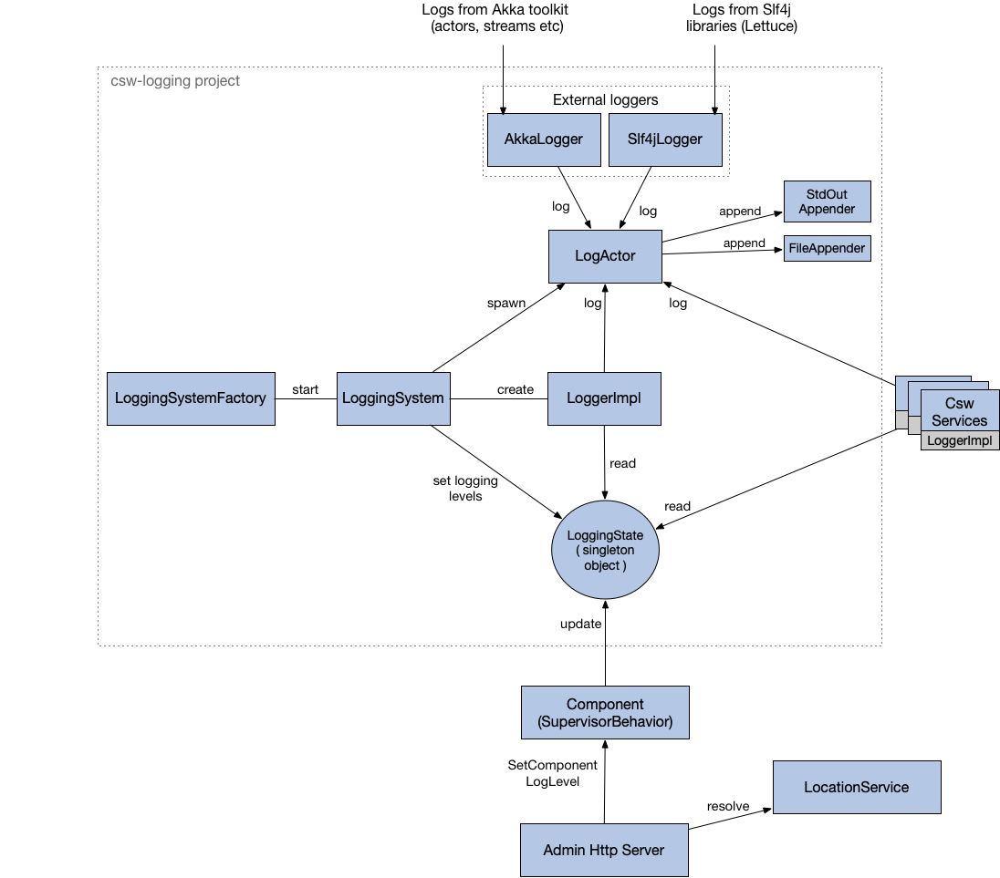
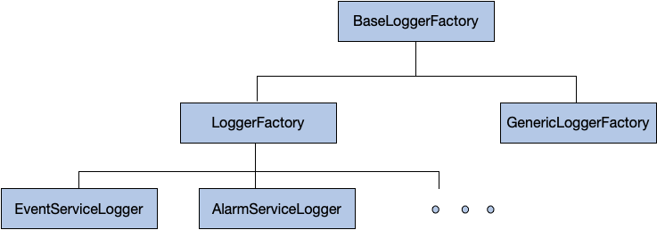

# Logging Service

The Logging Service library provides an advanced logging facility for CSW components and services.
The Logger API for @scaladoc[scala](csw/logging/api/scaladsl/Logger) and @scaladoc[java](csw/logging/api/javadsl/ILogger) allows logging
at different levels viz., `trace`, `debug`, `info`, `warn` and `error`.

The library allows separate log levels for the logging API, Akka logging, and Slf4J.
Also, it provides ability to set different log levels for different components.
To understand how to use the API refer to @ref:[this doc](../../services/logging.md).  

## Implementation Details

Following is a diagram showing the interaction of various classes, components and services in the Logging Service ecosystem.

For each container/standalone component, a new `csw.logging.client.internal.LoggingSystem` is created and started with the help of 
@scaladoc[LoggingSystemFactory](csw/logging/client/scaladsl/LoggingSystemFactory$).

`LoggingSystem` on creation performs various things:

* Spawning `csw.logging.client.internal.LogActor`. LogActor is the central component of Logging Service.
All the messages of changing log level at runtime and logging at different levels go through the LogActor.
Even external loggers `csw.logging.client.compat.AkkaLogger` and `csw.logging.client.compat.Slf4jAppender` 
send messages to `LogActor` in order to log messages to the 
configured appenders (@scaladoc[StdOutAppender](csw/logging/client/appenders/StdOutAppender) and
@scaladoc[FileAppender](csw/logging/client/appenders/FileAppender)).

* Creating `csw.logging.client.internal.LoggerImpl` which is a concrete implementation of `Logger` API. In order to 
do logging of messages sent by services/components, `LoggerImpl` also sends messages to `LogActor`.

* Load the default logging configurations from `logging.conf` and initialize `csw.logging.client.internal.LoggingState` which is 
a singleton object keeping track of the current logging state (levels of logging API, akka, slf4j and various components) 
of the application. `LoggingSystem` changes this `LoggingState` to change 
logging level of services/components. And `LoggerImpl` picks up from this state inorder to decide if the message needs 
to be logged or not depending on the current level set.

### Changing the Log Level of Components
The above figure also demonstrates the flow of a request for changing the log level of a component. 
Such a request would be initiated by some admin dashboard which will access the Admin Http Server.
On receiving the request, Admin Http Server will resolve the component using Location Service 
and send that component a @scaladoc[SetComponentLogLevel](csw/command/client/messages/SetComponentLogLevel) message.
This message is received by the component's Supervisor (`SupervisorBehavior`) which then changes the global `LoggingState`.
On any following logs of that component, the new `LoggingState` will be used in `LoggerImpl` 
to decide whether it needs to be logged or not.

### External Loggers 
External loggers like AkkaLogger and Slf4jAppender are wired up such that any logs from those libraries
(Akka and others that implement Slf4j like log4j, logback, tinylog etc) will go through our facade of AkkaLogger
and Slf4jAppender respectively. For AkkaLogger, there is a configuration `akka.loggers` specified in `logging.conf` which does
this wiring and for Slf4jAppender `logback.xml` is configured. AkkaLogger and Slf4jAppender then forward these logs to the `LogActor`.

### Hierarchy of LoggerFactories 

All the services for e.g. Event Service, Alarm Service etc, create their own instances of LoggerFactory 
which inherit from @scaladoc[LoggerFactory](csw/logging/client/scaladsl/LoggerFactory) provided by `csw-logging-client`.

The below diagram shows the hierarchy of the LoggerFactory and where do the Service Loggers stand in that tree.

