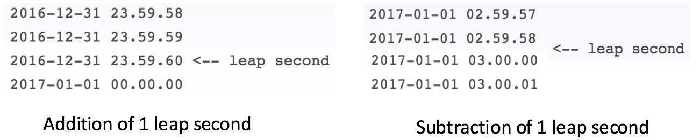
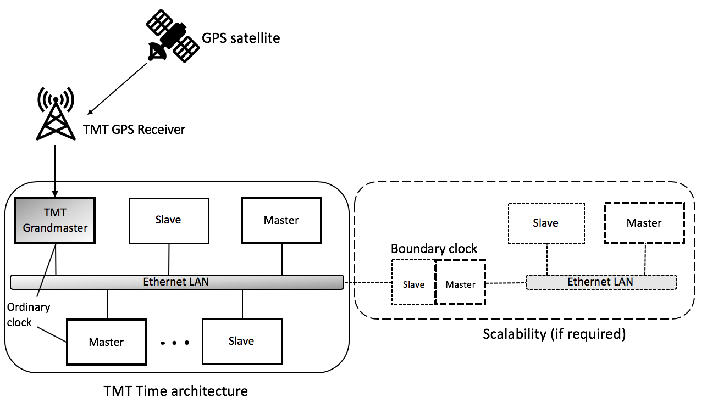
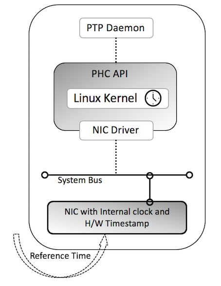

# Time Service

## Introduction
The time service implementation provides API for managing time across
various components within the TMT architecture. TMT has standardised on
the use of Precision Time Protocol (PTP), an IEEE 1588 standard, as the
basis of observatory time to achieve sub-microsecond accuracy and
precision. The PTP grand master clock (a hardware device) is
synchronized to the Global Positioning System (GPS) time. Each computer
system participating in the PTP network synchronizes to Observatory Time
using the PTP protocol. For higher accuracy in time measurements,
hardware time stamping is recommended and the network entities should be
fitted with PTP capable Network Interface Cards (NIC).

The TMT time service relies on making native calls (Linux kernel C methods
invocation) to get the nanosecond precise time overcoming the
limitations of Scala and Java libraries which support only microsecond
precision till date. These native calls are provided as wrapper over
Java and Scala APIs for easy use by component developers familiar with
Java/Scala. The TMT time service is responsible for primarily providing
time in @ref:[Coordinated Universal Time (UTC)](#summary-of-relevant-time-metrics) and @ref:[International Atomic
Time (TAI)](#summary-of-relevant-time-metrics) time scales. The handling of @ref:[leap second](#summary-of-relevant-time-metrics) event is taken care
by the TMT time service automatically(without human intervention) as the PTP grandmaster distributes the accurate information 
when received through GPS.

The time service also allows for scheduling tasks either periodically or
once using both UTC and TAI time. These schedulers are optimised for
handling scheduled tasks at 1KHz frequency or 1 task every 1 millisecond.
However, there can be jitters due to JVM garbage collection, CPU loads
and concurrent task execution.

## Summary of relevant time metrics

  - Second – A second is defined as 9,192,631,770 cycles of radiation
    corresponding to the transition between two hyperfine levels of the
    ground state of caesium 133

  - Leap Second – A second which is introduced to compensate for slight
    error in Earth’s rotation.
    
  
 
  - Time zones
    
      - TAI – International Atomic Time (Temps Atomique International)
        is defined as the weighted average of the time kept by about 200
        atomic clocks in over 50 national laboratories worldwide. TAI
        was introduced in Jan 1, 1958.
    
      - UT – Universal Time (UT1 or UT) is a time standard based on
        Earth's rotation. It is a modern continuation of Greenwich Mean
        Time (GMT) i.e., mean solar time.
    
      - UTC – Coordinated Universal Time (UTC) is the primary time
        standard by which the world regulates clocks and time. It is
        always within 1 second of UT. UTC differs from TAI by an
        integral number of seconds (currently 37). When needed, leap
        seconds are updated in UTC. UTC was introduced in 1972.
    
      - GPS – Global Positioning System Time is a uniformly counting
        time scale beginning at 00:00 of January 6, 1980. No leap seconds are
        inserted into GPS time. GPS time is always 19 seconds behind
        TAI.

  - Various [clock quality
    factors](http://www.ntp.org/ntpfaq/NTP-s-sw-clocks-quality/)
    determine the effectiveness of a time implementation.

## Overview of IEEE 1588

The IEEE 1588 standard describes a protocol, PTP, used to synchronize
clocks throughout a computer network using either UDP or TCP network packets. On an ethernet based local area network, it
achieves clock accuracy in the sub-microsecond range, making it suitable
for measurement and control systems. PTP is currently employed in
diverse distributed domains and networks that require precise timing but
lack access to satellite navigation signals. The recommended timescale
of PTP is the same as TAI. PTP provides two mechanisms namely, hardware
time stamping and software time stamping to achieve such a high
accuracy.

## TMT Time service architecture

The IEEE 1588 standards describe a hierarchical master-slave
architecture for clock distribution. TMT Time service architecture
follows the same topology as shown in the figure.

Under this architecture, a time distribution system consists of one or
more network segments, and one or more clocks. The standard offers an
automatic way for the configuration of the synchronization network,
based on the nodes pre-programmed capabilities. A synchronization
network consists one or more of the following entities:

  - Ordinary Clock - An ordinary clock is a device with a single network
    connection and is either the source of (master) or destination for
    (slave) a synchronization reference.

  - Grandmaster - The root timing reference of a distributed network is
    called the grandmaster. The grandmaster transmits synchronization
    information to the clocks residing on its network segment.

  - Boundary Clock (Optional) - A boundary clock has multiple network
    connections and can accurately synchronize one network segment to
    another. Once a boundary clock residing in a network segment having
    a grandmaster is synchronized it can then relay accurate time to the
    other connected network segments.

  - Transparent Clock (Optional) - The transparent clock modifies PTP
    messages as they pass through the device. Timestamps in the messages
    are corrected for time spent traversing the network equipment. This
    scheme improves distribution accuracy by compensating for delivery
    variability across the network.

  - Refer
    [this](https://blog.meinbergglobal.com/2013/10/21/ieee-1588-clock-types/)
    for more details on various clocks.



For TMT, a simplified PTP system consisting of ordinary clocks connected
to a single network, and no boundary clocks can be used. A grandmaster
is elected and all other clocks synchronize directly to it. The
grandmaster is a special entity which is configured to receive the
accurate GPS time information (TAI time, TAI-UTC offset etc.) through a
TMT GPS receiver. A master clock has the capability to serve the other
nodes in the network when a grandmaster has failed. Such a master clock
is elected as a grandmaster using the [Best Master Clock
Algorithm](https://en.wikipedia.org/wiki/Precision_Time_Protocol#Best_master_clock_algorithm).
A clock in the network distribution can be ‘*slave only*’ which will
enforce it to be a slave, always. In case a new network segment is
introduced a boundary clock can be set up to synchronize with the TMT
grandmaster time.
[Synchronization](https://en.wikipedia.org/wiki/Precision_Time_Protocol#Synchronization)
and management of a PTP system is achieved through the exchange of
[protocol
messages](https://en.wikipedia.org/wiki/Precision_Time_Protocol#Protocol_details)
across the network segments.

## Internals of a Network Component

In case of TMT most of the synchronization components will be based on
Linux operating system. For understanding the internal working of Linux
clock one can refer to [this short
description](http://btorpey.github.io/blog/2014/02/18/clock-sources-in-linux/#fnref:1)
or follow ‘Chapter 6’ of [the detailed
document](https://doc.lagout.org/operating%20system%20/linux/Understanding%20Linux%20Kernel.pdf).
The block diagram of an ordinary clock is shown in the following figure.



A reference time is transmitted through the Ethernet LAN from a
master/grandmaster clock. To achieve sub-microsecond accuracy and
precision, the Network Interface Card (NIC) of the component must have
the capability to perform hardware timestamping, and an internal PTP
Hardware Clock(PHC). Here's a [list](https://id.atlassian.com/login?continue=https%3A%2F%2Ftmt-project.atlassian.net%2Flogin%3FredirectCount%3D1%26dest-url%3D%252Fwiki%252Fspaces%252FDEOPSCSW%252Fpages%252F452296820%252FPTP%252BDriver%252BMatrix%252BSupport%26application%3Dconfluence&application=confluence) 
which mentions of such capable NICs while there are various new
additions in the market. Most of the current NICs are able to handle PTP
protocol by default. Run the following command to find the details of a
NIC.

```bash
sudo lshw -class network
``` 

The PHC API is an application programming interface which serves as a
simplified tool to access and program the on–board clocks on the network
adapters. This API is a part of the Linux kernel and synchronizes Linux
clock with external time. The PTP Daemon protocol stack implements the
specified rules of the synchronization by the IEEE 1588:2008 standard.
The reliable and popular [LinuxPTP
project](https://linuxptp.sourceforge.net/) is utilised as the PTP Daemon
for TMT since it meets the general requirements of supporting PTP
synchronization across the network. LinuxPTP updates the PHC API to set
the correct time on the Linux kernel as well as the system wall clock.

@@@ note
The ports 319 and 320 should be open for PTP to transmit messages.
Run the following commands to update iptables.

```bash
 iptables -I INPUT -p udp -m udp --dport 319 -j ACCEPT
 iptables -I INPUT -p udp -m udp --dport 320 -j ACCEPT
 
 firewall-cmd --permanent --zone=public --add-port=319/udp
 firewall-cmd --permanent --zone=public --add-port=320/udp
```
@@@
 
The recommendation is to utilise the PTP Hardware
Timestamping(available at the PHY layer in a network stack) mechanism for TMT to
meet the nanosecond requirement. [Various tests](https://id.atlassian.com/login?continue=https%3A%2F%2Ftmt-project.atlassian.net%2Flogin%3FredirectCount%3D1%26dest-url%3D%252Fwiki%252Fspaces%252FDEOPSCSW%252Fpages%252F279543820%252FPTP%252BHardware%252BTimeStamping%26application%3Dconfluence&application=confluence) are performed and
documented to support the sub-microsecond capability of IEEE 1588
standard using H/W timestamping. In contrast, the PTP software
timestamping makes use of the application layer timestamp having a
latency overhead.

## Usage of PTP time

The PTP synchronization assures that the whole TMT system is following
an accurate UTC/TAI time with high precision. All the applications
running inside TMT should make use of the PTP time to perform time
related operations like logging, scheduling etc.

### Extracting time

The CSW provides the time service APIs written in Scala and Java for the
component developers. Once the Linux kernel is set with PTP time, these
APIs use Java Native Access (JNA) based kernel calls to fetch the time
information. The class @javadoc[TimeLibrary](csw/time/clock/natives/TimeLibrary.java) is responsible for loading the Linux
kernel C libraries and declare the native methods relevant for
extracting time information. The clock id determines the clock to fetch time.

Scala
:   @@snip [ClockId.scala](../../../../../csw-time/csw-time-clock/jvm/src/main/scala/csw/time/clock/natives/models/ClockId.scala) { #clock-id }

The following snippet defines the usage of
JNA kernel call to fetch UTC/TAI time and tai\_offset(kernel variable)
in the Scala API.

Scala
:   @@snip [TMTClock.scala](../../../../../csw-time/csw-time-clock/jvm/src/main/scala/csw/time/clock/natives/models/TMTClock.scala) { #native-calls }

@@@ note

Based on the [comparison between JNA and JNI](https://id.atlassian.com/login?continue=https%3A%2F%2Ftmt-project.atlassian.net%2Flogin%3FredirectCount%3D1%26dest-url%3D%252Fwiki%252Fspaces%252FDEOPSCSW%252Fpages%252F305102849%252FComparative%252Bstudy%252Bof%252BJNI%252Bvs%252BJNA%26application%3Dconfluence&application=confluence)
     
and stakeholder agreement, JNA was fixed to make the low level kernel
calls.

@@@

### Scheduling

TMT time service provides scheduler for scheduling tasks once or
periodically. The schedulers can be used to handle tasks at 1KHz
frequency or 1 task every millisecond. However, jitters and JVM garbage
collection can degrade the performance of the schedulers at such a high
frequency. Internally, the scheduler APIs makes use of ‘[Akka Scheduler
Library](https://doc.akka.io/libraries/akka-http/current/)’. The
results published in [here](https://id.atlassian.com/login?continue=https%3A%2F%2Ftmt-project.atlassian.net%2Flogin%3FredirectCount%3D1%26dest-url%3D%252Fwiki%252Fspaces%252FDEOPSCSW%252Fpages%252F298680332%252FComparative%252Bstudy%252Bof%252Bscheduler%252Boptions%252Bfor%252B1KHz%252B1ms%252Bscheduling%252Brate%26application%3Dconfluence&application=confluence)
compares some of the options and makes strong recommendation to use the
Akka Schedulers. The snippets in the API documentation defines the schedule APIs in the
CSW library.

One of the major challenge in designing the scheduler was to handle the
leap second event. The leap second plays an important role in affecting
the UTC time. Therefore, a scheduler accepting future UTC time as a
start time can behave unpredictably and less accurately. Time service
scheduler APIs provide capability to schedule tasks on the absolute TAI
time synchronized using the IEEE 1588 standard. This approach eliminates
anomaly of a leap second event and provide robustness in the scheduling
mechanism. Depending on developer’s choice, scheduled tasks are queued
in either UTC or TAI time encapsulated inside @scaladoc[TMTTime](csw/time/core/models/TMTTime).
